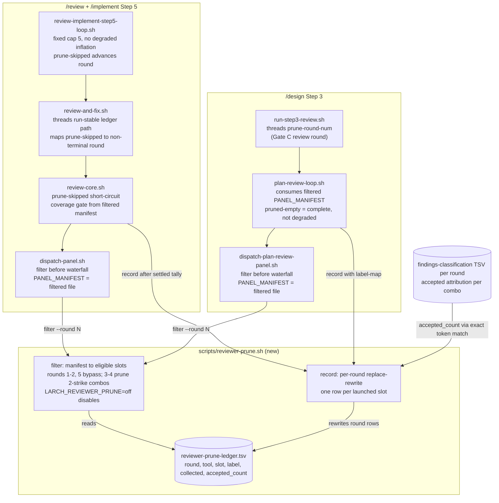

## Architecture Diagram

```mermaid
graph TD
    subgraph SharedHelper["scripts/reviewer-prune.sh (new)"]
        FILTER["filter: manifest to eligible slots<br/>rounds 1-2, 5 bypass; 3-4 prune 2-strike combos<br/>LARCH_REVIEWER_PRUNE=off disables"]
        RECORD["record: per-round replace-rewrite<br/>one row per launched slot"]
        LEDGER[("reviewer-prune-ledger.tsv<br/>round, tool, slot, label, collected, accepted_count")]
        FILTER -->|reads| LEDGER
        RECORD -->|rewrites round rows| LEDGER
    end

    subgraph CodeReview["/review + /implement Step 5"]
        RAF["review-and-fix.sh<br/>threads run-stable ledger path<br/>maps prune-skipped to non-terminal round"]
        CORE["review-core.sh<br/>prune-skipped short-circuit<br/>coverage gate from filtered manifest"]
        DP["dispatch-panel.sh<br/>filter before waterfall<br/>PANEL_MANIFEST = filtered file"]
        LOOP5["review-implement-step5-loop.sh<br/>fixed cap 5, no degraded inflation<br/>prune-skipped advances round"]
        RAF --> CORE
        CORE --> DP
        LOOP5 --> RAF
        DP -->|"filter --round N"| FILTER
        CORE -->|"record after settled tally"| RECORD
    end

    subgraph PlanReview["/design Step 3"]
        RSR["run-step3-review.sh<br/>threads prune-round-num<br/>(Gate C review round)"]
        PRL["plan-review-loop.sh<br/>consumes filtered PANEL_MANIFEST<br/>pruned-empty = complete, not degraded"]
        DPP["dispatch-plan-review-panel.sh<br/>filter before waterfall<br/>PANEL_MANIFEST = filtered file"]
        RSR --> PRL
        PRL --> DPP
        DPP -->|"filter --round N"| FILTER
        PRL -->|"record with label-map"| RECORD
    end

    TSV[("findings-classification TSV per round<br/>accepted attribution per combo")]
    TSV -->|"accepted_count via exact token match"| RECORD
```
