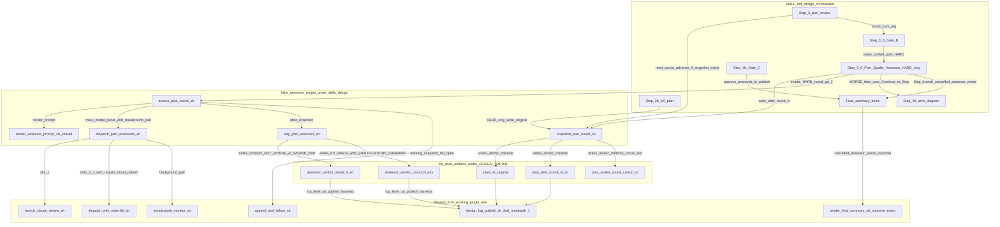

## Architecture Diagram

```mermaid
flowchart TD
    subgraph SKILL[SKILL_md_design_orchestrator]
        Step2b[Step_2b_full_plan]
        Step3[Step_3_plan_review]
        Step3_5[Step_3_5_Gate_B]
        Step3_6[Step_3_6_Plan_Quality_Assessor_HARD_only]
        Step3b[Step_3b_arch_diagram]
        Step4b[Step_4b_Gate_C]
        StepFinal[Final_summary_block]
    end

    subgraph NewScripts[New_assessor_scripts_under_skills_design]
        AssessPlan[assess_plan_round_sh]
        DispatchAssessors[dispatch_plan_assessors_sh]
        TallyAssessor[tally_plan_assessor_sh]
        SnapshotPlan[snapshot_plan_round_sh]
        RenderAssessor[render_assessor_prompt_sh_shared]
    end

    subgraph ReusedPrimitives[Reused_from_existing_plugin_tree]
        LaunchClaude[launch_claude_review_sh]
        WaterfallDispatch[dispatch_with_waterfall_sh]
        BreadcrumbMon[breadcrumb_monitor_sh]
        AppendTool[append_tool_failure_sh]
        RenderFinal[render_final_summary_sh_outcome_enum]
        DesignLog[design_log_publish_sh_find_maxdepth_1]
    end

    subgraph Artifacts[Top_level_artifacts_under_DESIGN_TMPDIR]
        PlanOriginal[plan_txt_original]
        PlanRoundN[plan_after_round_N_txt]
        CursorFile[plan_review_round_cursor_txt]
        VerdictTxt[assessor_verdict_round_N_txt]
        VerdictEnv[assessor_verdict_round_N_env]
    end

    Step2b -->|HARD_only_write_original| SnapshotPlan
    Step3 -->|read_cursor_advance_if_snapshot_exists| SnapshotPlan
    Step3 -->|round_num_arg| Step3_5
    Step3_5 -->|every_settled_path_HARD| Step3_6
    Step3_6 -->|write_after_round_N| SnapshotPlan
    Step3_6 -->|invoke_HARD_round_ge_2| AssessPlan
    Step3_6 -->|WORSE_then_user_Continue_or_Stop| Step3b
    Step3_6 -->|Stop_branch_cancelled_assessor_worse| StepFinal

    AssessPlan -->|render_prompt| RenderAssessor
    AssessPlan -->|cross_model_panel_with_breadcrumb_pair| DispatchAssessors
    AssessPlan -->|after_collection| TallyAssessor
    AssessPlan -->|missing_snapshot_fail_open| AppendTool

    DispatchAssessors -->|slot_1| LaunchClaude
    DispatchAssessors -->|slots_2_3_with_require_result_pattern| WaterfallDispatch
    DispatchAssessors -->|background_pair| BreadcrumbMon

    SnapshotPlan -->|writes_atomic_mktemp| PlanOriginal
    SnapshotPlan -->|writes_atomic_mktemp| PlanRoundN
    SnapshotPlan -->|writes_atomic_mktemp_cursor_last| CursorFile

    TallyAssessor -->|writes_compact_NOT_WORSE_or_WORSE_brief| VerdictTxt
    TallyAssessor -->|writes_KV_sidecar_with_QUALIFICATIONS_SUMMARY| VerdictEnv

    VerdictTxt -->|top_level_so_publish_harvests| DesignLog
    VerdictEnv -->|top_level_so_publish_harvests| DesignLog
    PlanOriginal --> DesignLog
    PlanRoundN --> DesignLog

    StepFinal -->|cancelled_assessor_worse_outcome| RenderFinal
    Step4b -->|approve_proceeds_to_publish| StepFinal
```
