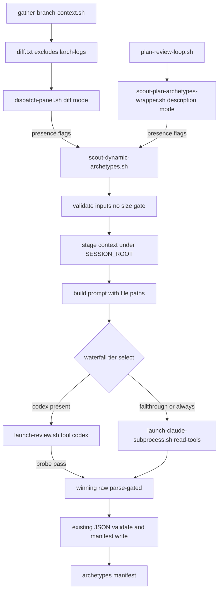

## Architecture Diagram

```mermaid
flowchart TD
    DP["dispatch-panel.sh diff mode"]
    PRL["plan-review-loop.sh"]
    WRAP["scout-plan-archetypes-wrapper.sh description mode"]
    SCOUT["scout-dynamic-archetypes.sh"]
    VAL["validate inputs no size gate"]
    STAGE["stage context under SESSION_ROOT"]
    PROMPT["build prompt with file paths"]
    WF{"waterfall tier select"}
    CODEX["launch-review.sh tool codex"]
    CLAUDE["launch-claude-subprocess.sh read-tools"]
    WIN["winning raw parse-gated"]
    PARSE["existing JSON validate and manifest write"]
    MANIFEST["archetypes manifest"]
    GBC["gather-branch-context.sh"]
    DIFF["diff.txt excludes larch-logs"]

    PRL --> WRAP
    DP -->|presence flags| SCOUT
    WRAP -->|presence flags| SCOUT
    SCOUT --> VAL
    VAL --> STAGE
    STAGE --> PROMPT
    PROMPT --> WF
    WF -->|codex present| CODEX
    WF -->|fallthrough or always| CLAUDE
    CODEX -->|probe pass| WIN
    CLAUDE --> WIN
    WIN --> PARSE
    PARSE --> MANIFEST
    GBC --> DIFF
    DIFF --> DP
```
