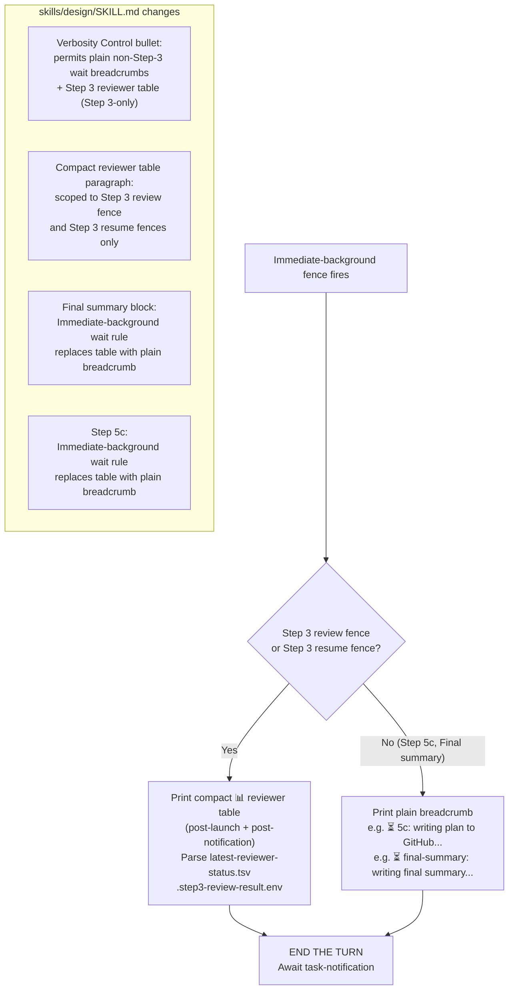

## Architecture Diagram

```mermaid
flowchart TD
    IB["Immediate-background fence fires"]
    IB --> Q{"Step 3 review fence\nor Step 3 resume fence?"}

    Q -->|"Yes"| S3["Print compact 📊 reviewer table\n(post-launch + post-notification)\nParse latest-reviewer-status.tsv\n.step3-review-result.env"]

    Q -->|"No (Step 5c, Final summary)"| PB["Print plain breadcrumb\ne.g. ⏳ 5c: writing plan to GitHub...\ne.g. ⏳ final-summary: writing final summary..."]

    S3 --> END_TURN["END THE TURN\nAwait task-notification"]
    PB --> END_TURN

    subgraph SKILL_MD["skills/design/SKILL.md changes"]
        VC["Verbosity Control bullet:\npermits plain non-Step-3 wait breadcrumbs\n+ Step 3 reviewer table (Step 3-only)"]
        CT["Compact reviewer table paragraph:\nscoped to Step 3 review fence\nand Step 3 resume fences only"]
        FS["Final summary block:\nImmediate-background wait rule\nreplaces table with plain breadcrumb"]
        SC["Step 5c:\nImmediate-background wait rule\nreplaces table with plain breadcrumb"]
    end
```
