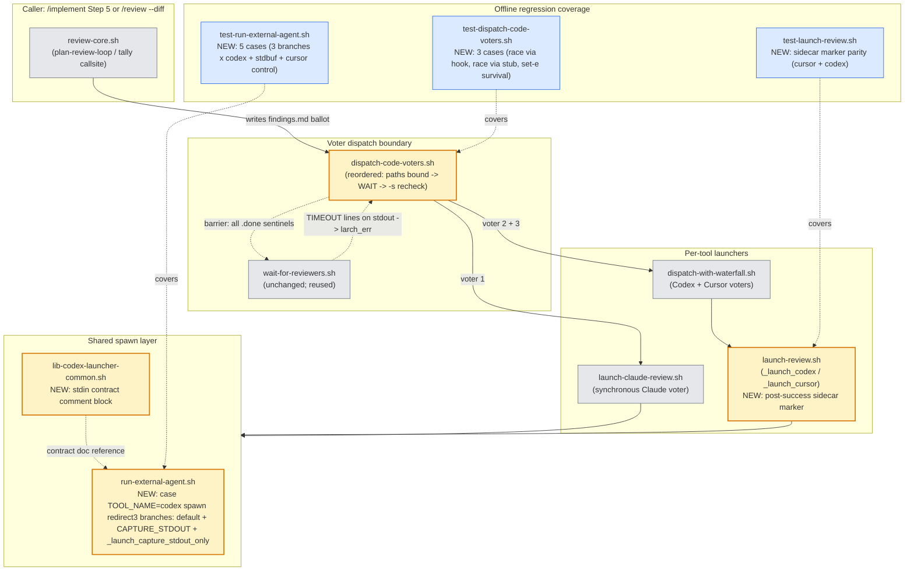

## Architecture Diagram

```mermaid
flowchart TD
    subgraph orchestrator["Caller: /implement Step 5 or /review --diff"]
        review_core["review-core.sh<br/>(plan-review-loop / tally callsite)"]
    end

    subgraph dispatch_layer["Voter dispatch boundary"]
        dispatch["dispatch-code-voters.sh<br/>(reordered: paths bound -> WAIT -> -s recheck)"]
        wait["wait-for-reviewers.sh<br/>(unchanged; reused)"]
    end

    subgraph launchers["Per-tool launchers"]
        launch_claude["launch-claude-review.sh<br/>(synchronous Claude voter)"]
        waterfall["dispatch-with-waterfall.sh<br/>(Codex + Cursor voters)"]
        launch_review["launch-review.sh<br/>(_launch_codex / _launch_cursor)<br/>NEW: post-success sidecar marker"]
    end

    subgraph spawn_layer["Shared spawn layer"]
        run_ext["run-external-agent.sh<br/>NEW: case TOOL_NAME=codex spawn redirect</dev/null<br/>3 branches: default + CAPTURE_STDOUT + _launch_capture_stdout_only"]
        codex_helper["lib-codex-launcher-common.sh<br/>NEW: stdin contract comment block"]
    end

    subgraph tests["Offline regression coverage"]
        test_dispatch["test-dispatch-code-voters.sh<br/>NEW: 3 cases (race via hook, race via stub, set-e survival)"]
        test_run_ext["test-run-external-agent.sh<br/>NEW: 5 cases (3 branches x codex + stdbuf + cursor control)"]
        test_launch["test-launch-review.sh<br/>NEW: sidecar marker parity (cursor + codex)"]
    end

    review_core -->|"writes findings.md ballot"| dispatch
    dispatch -->|"voter 1"| launch_claude
    dispatch -->|"voter 2 + 3"| waterfall
    waterfall --> launch_review
    launch_claude --> spawn_layer
    launch_review --> spawn_layer
    dispatch -.->|"barrier: all .done sentinels"| wait
    wait -.->|"TIMEOUT lines on stdout -> larch_err"| dispatch
    codex_helper -.->|"contract doc reference"| run_ext

    test_dispatch -.->|"covers"| dispatch
    test_run_ext -.->|"covers"| run_ext
    test_launch -.->|"covers"| launch_review

    classDef changed fill:#fef3c7,stroke:#d97706,stroke-width:2px
    classDef unchanged fill:#e5e7eb,stroke:#6b7280
    classDef test fill:#dbeafe,stroke:#2563eb

    class dispatch,run_ext,launch_review,codex_helper changed
    class wait,launch_claude,waterfall,review_core unchanged
    class test_dispatch,test_run_ext,test_launch test
```
