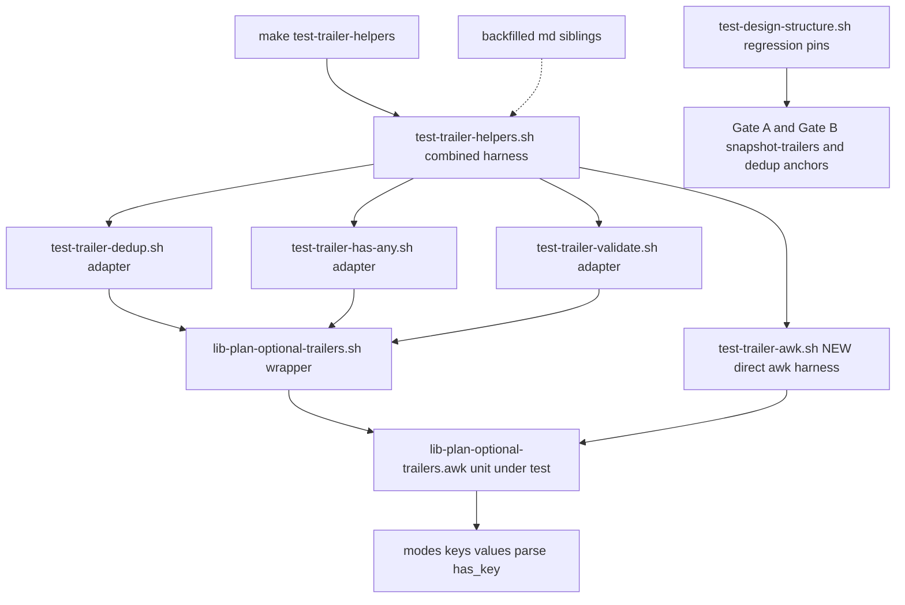

## Architecture Diagram

```mermaid
graph TD
    Make["make test-trailer-helpers"] --> Helpers["test-trailer-helpers.sh combined harness"]
    Helpers --> Dedup["test-trailer-dedup.sh adapter"]
    Helpers --> HasAny["test-trailer-has-any.sh adapter"]
    Helpers --> Validate["test-trailer-validate.sh adapter"]
    Helpers --> Awk["test-trailer-awk.sh NEW direct awk harness"]
    Dedup --> Wrapper["lib-plan-optional-trailers.sh wrapper"]
    HasAny --> Wrapper
    Validate --> Wrapper
    Wrapper --> AwkFile["lib-plan-optional-trailers.awk unit under test"]
    Awk --> AwkFile
    AwkFile --> Modes["modes keys values parse has_key"]
    Struct["test-design-structure.sh regression pins"] --> Anchors["Gate A and Gate B snapshot-trailers and dedup anchors"]
    Docs["backfilled md siblings"] -.-> Helpers
```
