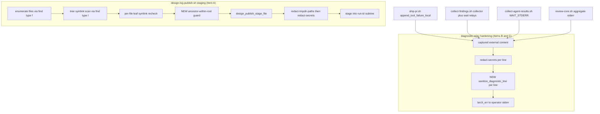

## Architecture Diagram

```mermaid
graph TD
    subgraph s1["design-log-publish.sh staging (Item A)"]
        A["enumerate files via find type f"] --> B["tree symlink scan via find type l"]
        B --> C["per-file leaf symlink recheck"]
        C --> D["NEW ancestor-within-root guard"]
        D --> E["design_publish_stage_file"]
        E --> F["redact-tmpdir-paths then redact-secrets"]
        F --> G["stage into run-id subtree"]
    end
    subgraph s2["diagnostic relay hardening (Items B and C)"]
        H["captured external content"] --> I["redact-secrets per line"]
        I --> J["NEW sanitize_diagnostic_line per line"]
        J --> K["larch_err to operator stderr"]
    end
    L["ship-pr.sh append_tool_failure_local"] --> H
    M["collect-findings.sh collector plus wait relays"] --> H
    N["collect-agent-results.sh WAIT_STDERR"] --> H
    O["review-core.sh aggregate stderr"] --> H
```
