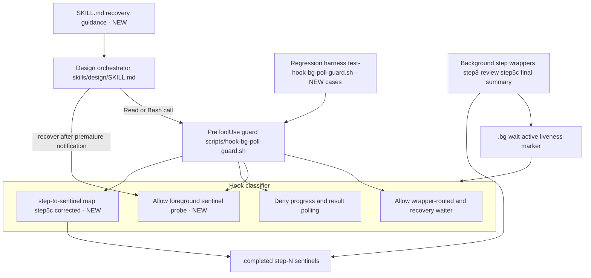

## Architecture Diagram

```mermaid
graph TD
    GUIDE["SKILL.md recovery guidance - NEW"]
    ORCH["Design orchestrator skills/design/SKILL.md"]
    HOOK["PreToolUse guard scripts/hook-bg-poll-guard.sh"]
    TEST["Regression harness test-hook-bg-poll-guard.sh - NEW cases"]
    WRAP["Background step wrappers step3-review step5c final-summary"]
    MARKER[".bg-wait-active liveness marker"]
    SENT[".completed step-N sentinels"]

    subgraph GUARD["Hook classifier"]
        ALLOW["Allow wrapper-routed and recovery waiter"]
        PROBE["Allow foreground sentinel probe - NEW"]
        MAP["step-to-sentinel map step5c corrected - NEW"]
        DENY["Deny progress and result polling"]
    end

    GUIDE --> ORCH
    ORCH -->|Read or Bash call| HOOK
    HOOK --> ALLOW
    HOOK --> PROBE
    HOOK --> DENY
    HOOK --> MAP
    TEST --> HOOK
    WRAP --> MARKER
    WRAP --> SENT
    MAP --> SENT
    MARKER --> GUARD
    ORCH -->|recover after premature notification| PROBE
```
