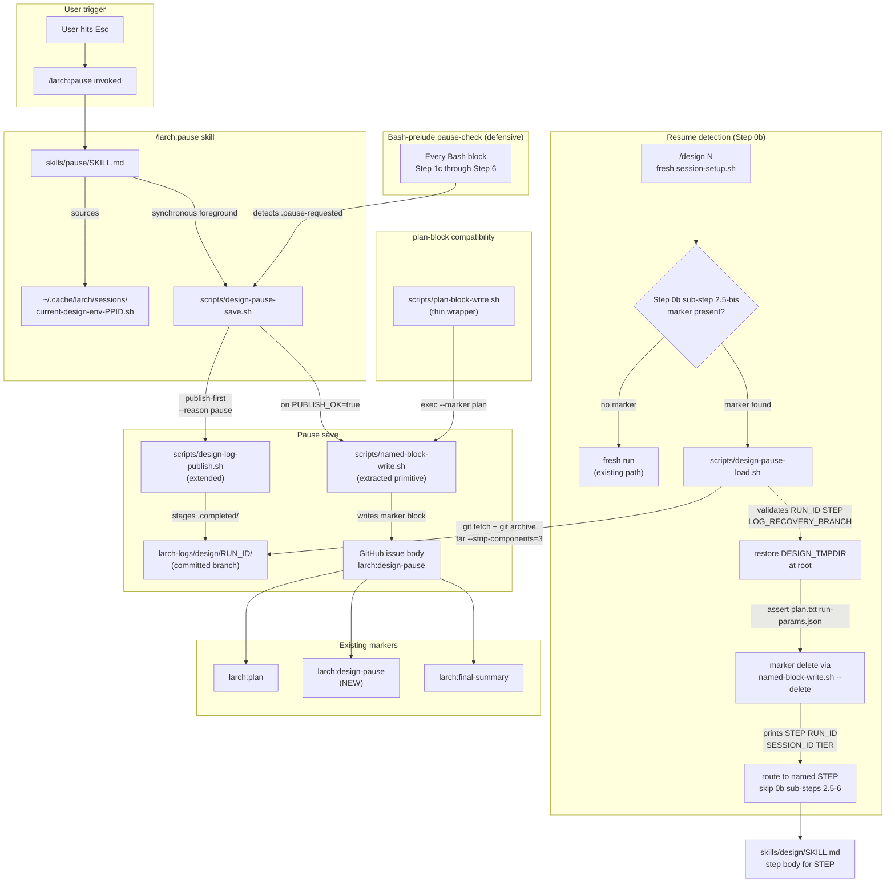

## Architecture Diagram

```mermaid
graph TD
    subgraph "User trigger"
        UE["User hits Esc"]
        UP["/larch:pause invoked"]
        UE --> UP
    end

    subgraph "/larch:pause skill"
        PS["skills/pause/SKILL.md"]
        UP --> PS
        PS -->|sources| ENV1["~/.cache/larch/sessions/<br/>current-design-env-PPID.sh"]
        PS -->|synchronous foreground| DPS
    end

    subgraph "Pause save"
        DPS["scripts/design-pause-save.sh"]
        DPS -->|"publish-first<br/>--reason pause"| DLP
        DPS -->|on PUBLISH_OK=true| NBW
        DLP["scripts/design-log-publish.sh<br/>(extended)"]
        NBW["scripts/named-block-write.sh<br/>(extracted primitive)"]
        DLP -->|stages .completed/| LB["larch-logs/design/RUN_ID/<br/>(committed branch)"]
        NBW -->|writes marker block| IB["GitHub issue body<br/>larch:design-pause"]
    end

    subgraph "Bash-prelude pause-check (defensive)"
        BP["Every Bash block<br/>Step 1c through Step 6"]
        BP -->|"detects .pause-requested"| DPS
    end

    subgraph "Resume detection (Step 0b)"
        SD["/design N<br/>fresh session-setup.sh"]
        SD --> S0B{"Step 0b sub-step 2.5-bis<br/>marker present?"}
        S0B -->|no marker| FRESH["fresh run<br/>(existing path)"]
        S0B -->|marker found| DPL
        DPL["scripts/design-pause-load.sh"]
        DPL -->|"git fetch + git archive<br/>tar --strip-components=3"| LB
        DPL -->|"validates RUN_ID STEP<br/>LOG_RECOVERY_BRANCH"| RES["restore DESIGN_TMPDIR<br/>at root"]
        RES -->|assert plan.txt run-params.json| MR["marker delete via<br/>named-block-write.sh --delete"]
        MR -->|"prints STEP RUN_ID<br/>SESSION_ID TIER"| RR["route to named STEP<br/>skip 0b sub-steps 2.5-6"]
    end

    subgraph "plan-block compatibility"
        PBW["scripts/plan-block-write.sh<br/>(thin wrapper)"]
        PBW -->|exec --marker plan| NBW
    end

    subgraph "Existing markers"
        IB --> MARK1["larch:plan"]
        IB --> MARK2["larch:design-pause<br/>(NEW)"]
        IB --> MARK3["larch:final-summary"]
    end

    RR --> SKILL["skills/design/SKILL.md<br/>step body for STEP"]
```
