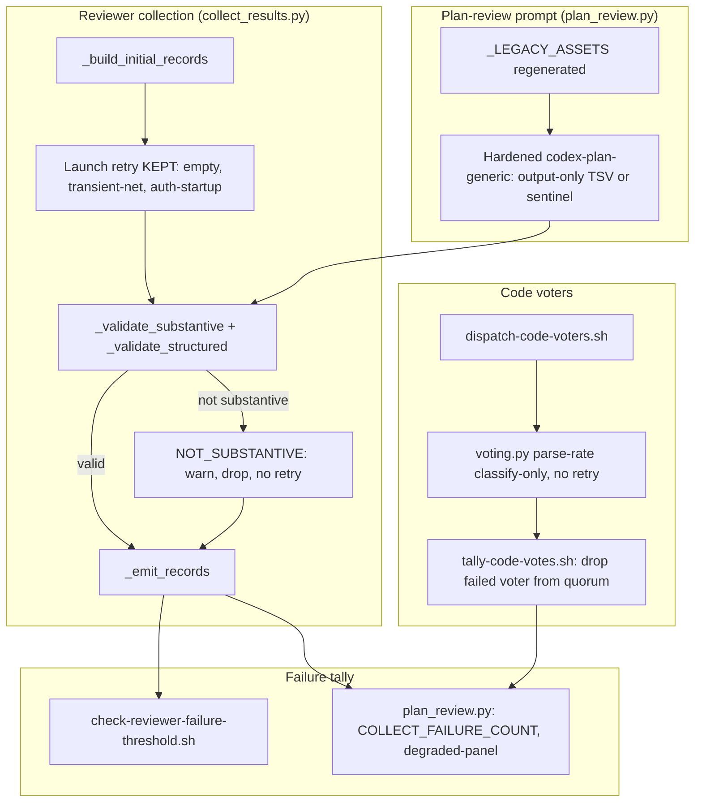

## Architecture Diagram

```mermaid
flowchart TD
    subgraph collect["Reviewer collection (collect_results.py)"]
        init["_build_initial_records"]
        launchRetry["Launch retry KEPT: empty, transient-net, auth-startup"]
        validate["_validate_substantive + _validate_structured"]
        dropNS["NOT_SUBSTANTIVE: warn, drop, no retry"]
        emit["_emit_records"]
    end

    subgraph prompt["Plan-review prompt (plan_review.py)"]
        generic["Hardened codex-plan-generic: output-only TSV or sentinel"]
        assets["_LEGACY_ASSETS regenerated"]
    end

    subgraph voter["Code voters"]
        dispatch["dispatch-code-voters.sh"]
        classify["voting.py parse-rate classify-only, no retry"]
        votetally["tally-code-votes.sh: drop failed voter from quorum"]
    end

    subgraph tally["Failure tally"]
        threshold["check-reviewer-failure-threshold.sh"]
        paneltally["plan_review.py: COLLECT_FAILURE_COUNT, degraded-panel"]
    end

    init --> launchRetry --> validate
    validate -->|valid| emit
    validate -->|not substantive| dropNS --> emit
    emit --> threshold
    emit --> paneltally
    assets --> generic --> validate
    dispatch --> classify --> votetally --> paneltally
```
