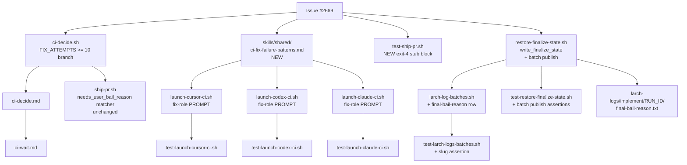

## Architecture Diagram

```mermaid
flowchart TD
    issue[Issue #2669]
    ci_decide["ci-decide.sh<br/>FIX_ATTEMPTS &gt;= 10 branch"]
    ci_decide_md["ci-decide.md"]
    ci_wait_md["ci-wait.md"]
    ship_pr["ship-pr.sh<br/>needs_user_bail_reason matcher<br/>unchanged"]
    fragment["skills/shared/<br/>ci-fix-failure-patterns.md<br/>NEW"]
    cursor_ci["launch-cursor-ci.sh<br/>fix-role PROMPT"]
    codex_ci["launch-codex-ci.sh<br/>fix-role PROMPT"]
    claude_ci["launch-claude-ci.sh<br/>fix-role PROMPT"]
    test_cursor_ci["test-launch-cursor-ci.sh"]
    test_codex_ci["test-launch-codex-ci.sh"]
    test_claude_ci["test-launch-claude-ci.sh"]
    test_ship["test-ship-pr.sh<br/>NEW exit-4 stub block"]
    batches["larch-log-batches.sh<br/>+ final-bail-reason row"]
    restore["restore-finalize-state.sh<br/>write_finalize_state<br/>+ batch publish"]
    test_restore["test-restore-finalize-state.sh<br/>+ batch publish assertions"]
    test_batches["test-larch-logs-batches.sh<br/>+ slug assertion"]
    runlog["larch-logs/implement/RUN_ID/<br/>final-bail-reason.txt"]

    issue --> ci_decide
    issue --> fragment
    issue --> test_ship
    issue --> restore

    ci_decide --> ship_pr
    ci_decide --> ci_decide_md
    ci_decide_md --> ci_wait_md

    fragment --> cursor_ci
    fragment --> codex_ci
    fragment --> claude_ci

    cursor_ci --> test_cursor_ci
    codex_ci --> test_codex_ci
    claude_ci --> test_claude_ci

    restore --> batches
    restore --> test_restore
    batches --> test_batches
    restore --> runlog
```
