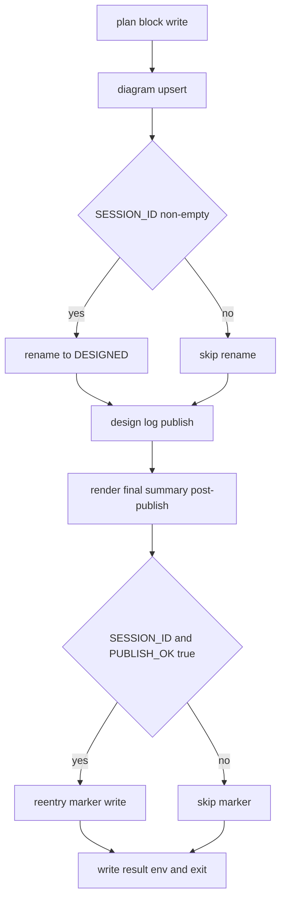

## Architecture Diagram

```mermaid
flowchart TD
    A[plan block write] --> B[diagram upsert]
    B --> C{SESSION_ID non-empty}
    C -- yes --> D[rename to DESIGNED]
    C -- no --> E[skip rename]
    D --> F[design log publish]
    E --> F
    F --> G[render final summary post-publish]
    G --> H{SESSION_ID and PUBLISH_OK true}
    H -- yes --> I[reentry marker write]
    H -- no --> J[skip marker]
    I --> Z[write result env and exit]
    J --> Z
```
