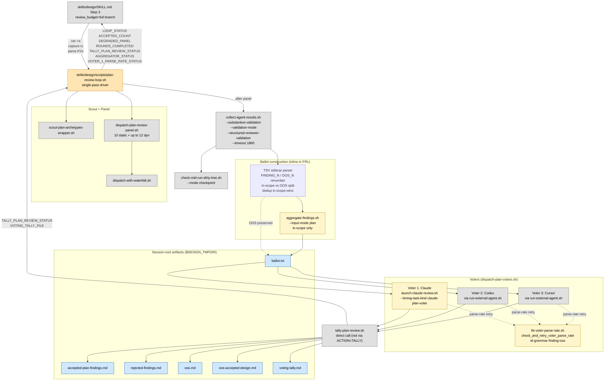

## Architecture Diagram

```mermaid
graph TD
  SKILL["skills/design/SKILL.md Step 3<br/>review_budget=full branch"]

  PRL["skills/design/scripts/plan-review-loop.sh<br/>single-pass driver"]

  subgraph Panel["Scout + Panel"]
    SCOUT["scout-plan-archetypes-wrapper.sh"]
    PANEL_DISP["dispatch-plan-review-panel.sh<br/>10 static + up to 12 dyn"]
    WATERFALL["dispatch-with-waterfall.sh"]
  end

  COLLECT["collect-agent-results.sh<br/>--substantive-validation<br/>--validation-mode<br/>--structured-reviewer-validation<br/>--timeout 1860"]
  DIRTY["check-mid-run-dirty-tree.sh<br/>--mode checkpoint"]

  subgraph Ballot["Ballot construction (inline in PRL)"]
    TSV["TSV sidecar parser<br/>FINDING_N / OOS_N renumber<br/>in-scope vs OOS split<br/>dedup in-scope-wins"]
    AGG["aggregate-findings.sh<br/>--input-mode plan<br/>in-scope only"]
  end

  subgraph Voters["Voters (dispatch-plan-voters.sh)"]
    V1["Voter 1: Claude<br/>launch-claude-review.sh<br/>--timing-task-kind claude-plan-voter"]
    V2["Voter 2: Codex<br/>via run-external-agent.sh"]
    V3["Voter 3: Cursor<br/>via run-external-agent.sh"]
    PARSERATE["lib-voter-parse-rate.sh<br/>check_and_retry_voter_parse_rate<br/>id-grammar finding-oos"]
  end

  TALLY["tally-plan-review.sh<br/>direct call (not via ACTION=TALLY)"]

  subgraph Artifacts["Session-root artifacts ($DESIGN_TMPDIR)"]
    BALLOT["ballot.txt"]
    ACCEPTED["accepted-plan-findings.md"]
    REJECTED["rejected-findings.md"]
    OOS["oos.md"]
    OOSACC["oos-accepted-design.md"]
    TALLY_MD["voting-tally.md"]
  end

  SKILL -->|"set +e<br/>capture rc<br/>parse KVs"| PRL
  PRL --> SCOUT
  PRL --> PANEL_DISP
  PANEL_DISP --> WATERFALL
  PRL -->|"after panel"| COLLECT
  COLLECT --> DIRTY
  COLLECT --> TSV
  TSV --> AGG
  TSV -.->|"OOS preserved"| BALLOT
  AGG --> BALLOT
  BALLOT --> V1
  BALLOT --> V2
  BALLOT --> V3
  V1 -.->|"parse-rate retry"| PARSERATE
  V2 -.->|"parse-rate retry"| PARSERATE
  V3 -.->|"parse-rate retry"| PARSERATE
  V1 --> TALLY
  V2 --> TALLY
  V3 --> TALLY
  TALLY --> ACCEPTED
  TALLY --> REJECTED
  TALLY --> OOS
  TALLY --> OOSACC
  TALLY --> TALLY_MD
  TALLY -->|"TALLY_PLAN_REVIEW_STATUS<br/>VOTING_TALLY_FILE"| PRL
  PRL -->|"LOOP_STATUS<br/>ACCEPTED_COUNT<br/>DEGRADED_PANEL<br/>ROUNDS_COMPLETED<br/>TALLY_PLAN_REVIEW_STATUS<br/>AGGREGATOR_STATUS<br/>VOTER_1_PARSE_RATE_STATUS"| SKILL

  classDef new fill:#ffe5b4,stroke:#cc7700,color:#000
  classDef updated fill:#fff5cc,stroke:#aa8800,color:#000
  classDef existing fill:#e0e0e0,stroke:#666,color:#000
  classDef artifact fill:#d0e8ff,stroke:#0055aa,color:#000

  class PRL new
  class V1,PARSERATE,AGG updated
  class SKILL,SCOUT,PANEL_DISP,WATERFALL,COLLECT,DIRTY,V2,V3,TALLY existing
  class BALLOT,ACCEPTED,REJECTED,OOS,OOSACC,TALLY_MD artifact
```
