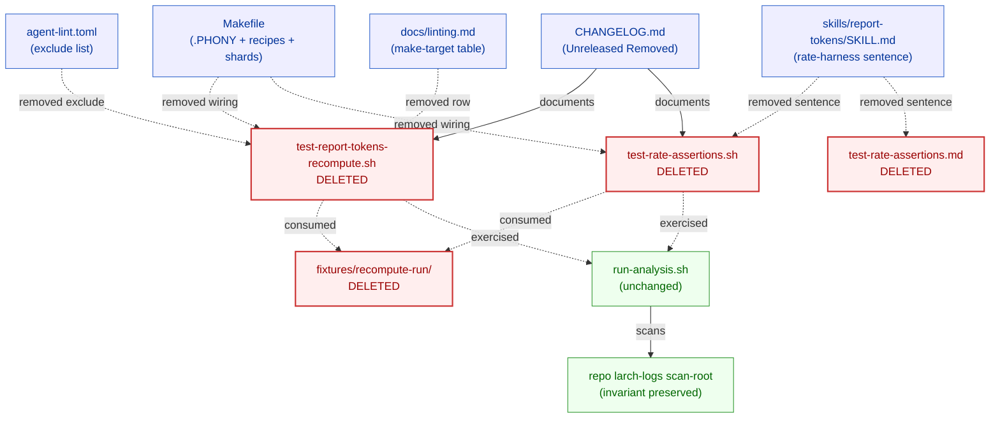

## Architecture Diagram

```mermaid
graph TD
    Makefile["Makefile<br/>(.PHONY + recipes + shards)"]
    AgentLint["agent-lint.toml<br/>(exclude list)"]
    LintingDocs["docs/linting.md<br/>(make-target table)"]
    SkillMd["skills/report-tokens/SKILL.md<br/>(rate-harness sentence)"]
    Changelog["CHANGELOG.md<br/>(Unreleased Removed)"]

    TestRecompute["test-report-tokens-recompute.sh<br/>DELETED"]
    TestRate["test-rate-assertions.sh<br/>DELETED"]
    TestRateMd["test-rate-assertions.md<br/>DELETED"]
    Fixtures["fixtures/recompute-run/<br/>DELETED"]

    RunAnalysis["run-analysis.sh<br/>(unchanged)"]
    RealLogs["repo larch-logs scan-root<br/>(invariant preserved)"]

    Makefile -. removed wiring .-> TestRecompute
    Makefile -. removed wiring .-> TestRate
    AgentLint -. removed exclude .-> TestRecompute
    LintingDocs -. removed row .-> TestRecompute
    SkillMd -. removed sentence .-> TestRate
    SkillMd -. removed sentence .-> TestRateMd

    TestRecompute -. consumed .-> Fixtures
    TestRate -. consumed .-> Fixtures
    TestRecompute -. exercised .-> RunAnalysis
    TestRate -. exercised .-> RunAnalysis

    RunAnalysis -- scans --> RealLogs

    Changelog -- documents --> TestRecompute
    Changelog -- documents --> TestRate

    classDef deleted fill:#fee,stroke:#c33,stroke-width:2px,color:#900
    classDef preserved fill:#efe,stroke:#393,color:#060
    classDef edited fill:#eef,stroke:#36c,color:#039

    class TestRecompute,TestRate,TestRateMd,Fixtures deleted
    class RunAnalysis,RealLogs preserved
    class Makefile,AgentLint,LintingDocs,SkillMd,Changelog edited
```
