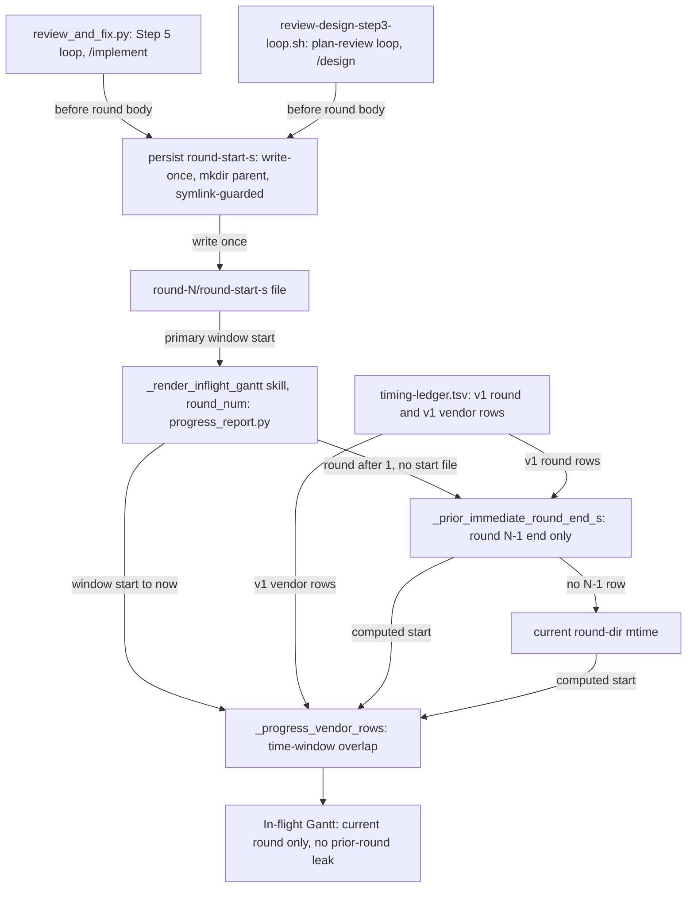

## Architecture Diagram

```mermaid
graph TD
    RAF["review_and_fix.py: Step 5 loop, /implement"]
    RDL["review-design-step3-loop.sh: plan-review loop, /design"]
    PRS["persist round-start-s: write-once, mkdir parent, symlink-guarded"]
    RSF["round-N/round-start-s file"]

    RAF -->|before round body| PRS
    RDL -->|before round body| PRS
    PRS -->|write once| RSF

    IRG["_render_inflight_gantt skill, round_num: progress_report.py"]
    PIE["_prior_immediate_round_end_s: round N-1 end only"]
    MT["current round-dir mtime"]
    PVR["_progress_vendor_rows: time-window overlap"]
    TL["timing-ledger.tsv: v1 round and v1 vendor rows"]
    OUT["In-flight Gantt: current round only, no prior-round leak"]

    RSF -->|primary window start| IRG
    IRG -->|round after 1, no start file| PIE
    PIE -->|no N-1 row| MT
    TL -->|v1 round rows| PIE
    IRG -->|window start to now| PVR
    TL -->|v1 vendor rows| PVR
    PIE -->|computed start| PVR
    MT -->|computed start| PVR
    PVR --> OUT
```
