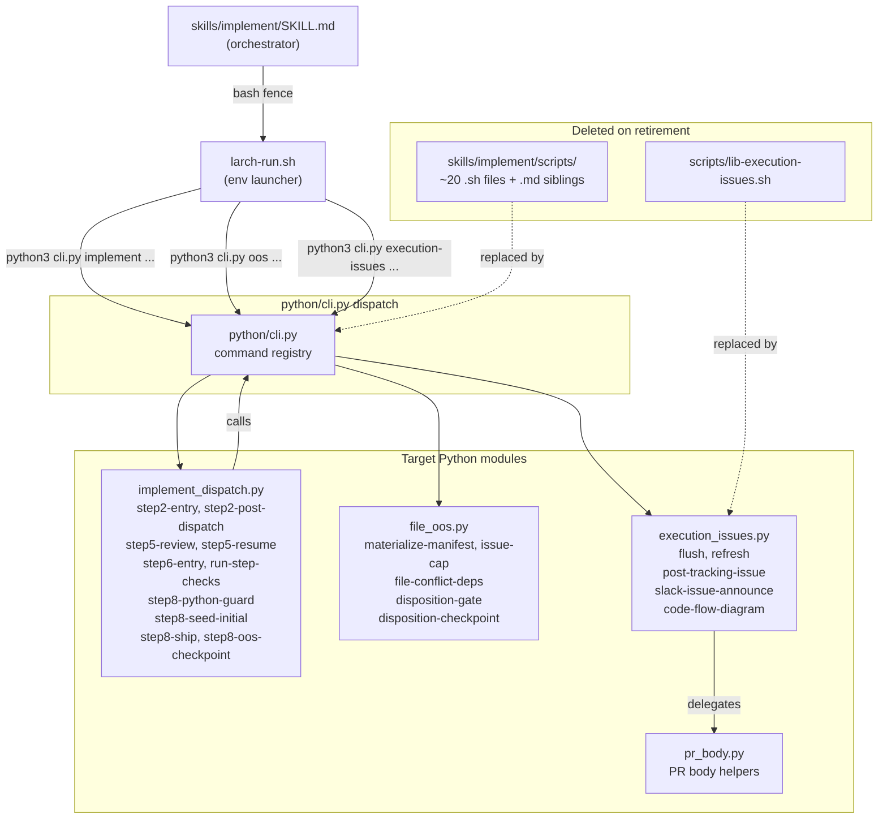

## Architecture Diagram

```mermaid
graph TD
    SKILL["skills/implement/SKILL.md\n(orchestrator)"]
    LRun["larch-run.sh\n(env launcher)"]

    subgraph "python/cli.py dispatch"
        CLI["python/cli.py\ncommand registry"]
    end

    subgraph "Target Python modules"
        ID["implement_dispatch.py\nstep2-entry, step2-post-dispatch\nstep5-review, step5-resume\nstep6-entry, run-step-checks\nstep8-python-guard\nstep8-seed-initial\nstep8-ship, step8-oos-checkpoint"]
        FO["file_oos.py\nmaterialize-manifest, issue-cap\nfile-conflict-deps\ndisposition-gate\ndisposition-checkpoint"]
        EI["execution_issues.py\nflush, refresh\npost-tracking-issue\nslack-issue-announce\ncode-flow-diagram"]
        PRB["pr_body.py\nPR body helpers"]
    end

    subgraph "Deleted on retirement"
        BashScripts["skills/implement/scripts/\n~20 .sh files + .md siblings"]
        LibEI["scripts/lib-execution-issues.sh"]
    end

    SKILL -->|"bash fence"| LRun
    LRun -->|"python3 cli.py implement ..."| CLI
    LRun -->|"python3 cli.py oos ..."| CLI
    LRun -->|"python3 cli.py execution-issues ..."| CLI
    CLI --> ID
    CLI --> FO
    CLI --> EI
    EI -->|"delegates"| PRB
    ID -->|"calls"| CLI

    BashScripts -.->|"replaced by"| CLI
    LibEI -.->|"replaced by"| EI
```
