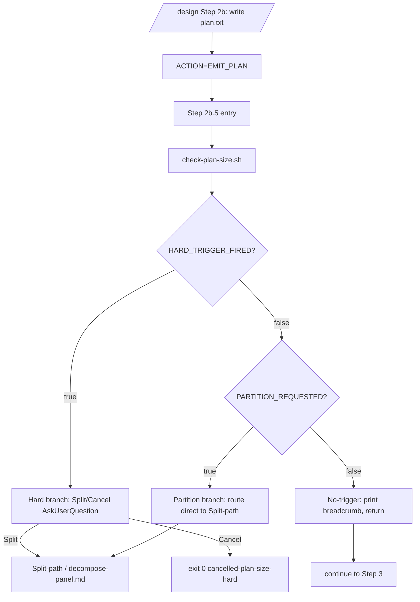

## Architecture Diagram

```mermaid
flowchart TD
    A[/design Step 2b: write plan.txt/] --> B[ACTION=EMIT_PLAN]
    B --> C[Step 2b.5 entry]
    C --> D[check-plan-size.sh]
    D --> E{HARD_TRIGGER_FIRED?}
    E -->|true| F[Hard branch: Split/Cancel AskUserQuestion]
    E -->|false| G{PARTITION_REQUESTED?}
    G -->|true| H[Partition branch: route direct to Split-path]
    G -->|false| I[No-trigger: print breadcrumb, return]
    F -->|Split| J[Split-path / decompose-panel.md]
    H --> J
    F -->|Cancel| K[exit 0 cancelled-plan-size-hard]
    I --> L[continue to Step 3]
```
