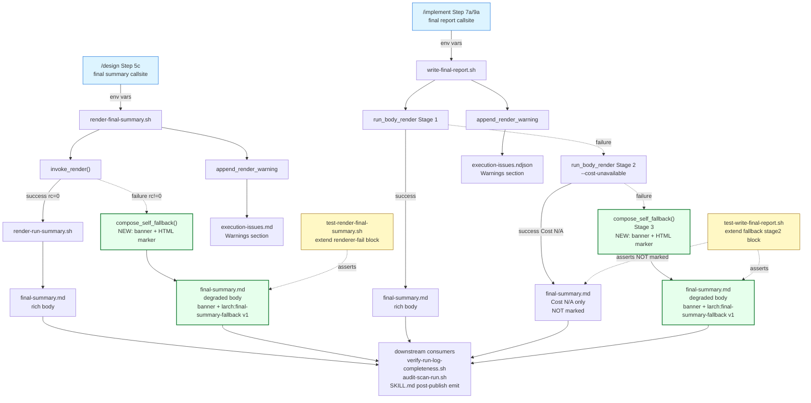

## Architecture Diagram

```mermaid
flowchart TD
  caller_design["/design Step 5c<br/>final summary callsite"] -->|env vars| rfs["render-final-summary.sh"]
  caller_implement["/implement Step 7a/9a<br/>final report callsite"] -->|env vars| wfr["write-final-report.sh"]

  rfs --> invoke_render["invoke_render()"]
  invoke_render -->|success rc=0| render_design["render-run-summary.sh"]
  render_design --> body_full_design["final-summary.md<br/>rich body"]
  invoke_render -.->|failure rc!=0| compose_self_design["compose_self_fallback()<br/>NEW: banner + HTML marker"]
  compose_self_design --> body_fallback_design["final-summary.md<br/>degraded body<br/>banner + larch:final-summary-fallback v1"]
  rfs --> append_design["append_render_warning"]
  append_design --> exec_log_design["execution-issues.md<br/>Warnings section"]

  wfr --> run_body_stage1["run_body_render Stage 1"]
  run_body_stage1 -->|success| body_full_implement["final-summary.md<br/>rich body"]
  run_body_stage1 -.->|failure| run_body_stage2["run_body_render Stage 2<br/>--cost-unavailable"]
  run_body_stage2 -->|success Cost N/A| body_cost_na["final-summary.md<br/>Cost N/A only<br/>NOT marked"]
  run_body_stage2 -.->|failure| compose_self_implement["compose_self_fallback()<br/>Stage 3<br/>NEW: banner + HTML marker"]
  compose_self_implement --> body_fallback_implement["final-summary.md<br/>degraded body<br/>banner + larch:final-summary-fallback v1"]
  wfr --> append_implement["append_render_warning"]
  append_implement --> exec_log_implement["execution-issues.ndjson<br/>Warnings section"]

  body_full_design --> consumers["downstream consumers<br/>verify-run-log-completeness.sh<br/>audit-scan-run.sh<br/>SKILL.md post-publish emit"]
  body_fallback_design --> consumers
  body_full_implement --> consumers
  body_cost_na --> consumers
  body_fallback_implement --> consumers

  test_design["test-render-final-summary.sh<br/>extend renderer-fail block"] -.->|asserts| body_fallback_design
  test_implement["test-write-final-report.sh<br/>extend fallback stage2 block"] -.->|asserts| body_fallback_implement
  test_implement -.->|asserts NOT marked| body_cost_na

  classDef changed fill:#e6ffec,stroke:#1a7f37,stroke-width:2px;
  classDef test fill:#fff8c5,stroke:#9a6700;
  classDef caller fill:#ddf4ff,stroke:#0969da;
  class compose_self_design,compose_self_implement,body_fallback_design,body_fallback_implement changed;
  class test_design,test_implement test;
  class caller_design,caller_implement caller;
```
