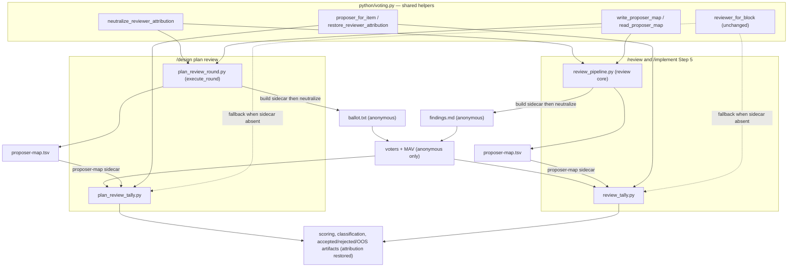

## Architecture Diagram

```mermaid
graph TD
    subgraph shared["python/voting.py — shared helpers"]
        H1["neutralize_reviewer_attribution"]
        H2["write_proposer_map / read_proposer_map"]
        H3["proposer_for_item / restore_reviewer_attribution"]
        H4["reviewer_for_block (unchanged)"]
    end

    subgraph design["/design plan review"]
        DR["plan_review_round.py (execute_round)"]
        DT["plan_review_tally.py"]
    end

    subgraph code["/review and /implement Step 5"]
        RP["review_pipeline.py (review core)"]
        RT["review_tally.py"]
    end

    DR -->|"build sidecar then neutralize"| DB["ballot.txt (anonymous)"]
    DR --> DM["proposer-map.tsv"]
    RP -->|"build sidecar then neutralize"| RF["findings.md (anonymous)"]
    RP --> RM["proposer-map.tsv"]

    DB --> V["voters + MAV (anonymous only)"]
    RF --> V

    V --> DT
    V --> RT
    DM -->|"proposer-map sidecar"| DT
    RM -->|"proposer-map sidecar"| RT

    DT --> ART["scoring, classification, accepted/rejected/OOS artifacts (attribution restored)"]
    RT --> ART

    H1 --> DR
    H1 --> RP
    H2 --> DR
    H2 --> RP
    H3 --> DT
    H3 --> RT
    H4 -.->|"fallback when sidecar absent"| DT
    H4 -.->|"fallback when sidecar absent"| RT
```
