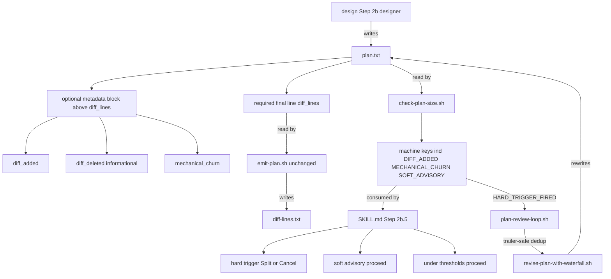

## Architecture Diagram

```mermaid
graph TD
    Designer["design Step 2b designer"] -->|writes| Plan["plan.txt"]
    Plan --> Block["optional metadata block above diff_lines"]
    Block --> TA["diff_added"]
    Block --> TD["diff_deleted informational"]
    Block --> TM["mechanical_churn"]
    Plan --> Req["required final line diff_lines"]

    Req -->|read by| Emit["emit-plan.sh unchanged"]
    Emit -->|writes| DLT["diff-lines.txt"]

    Plan -->|read by| Check["check-plan-size.sh"]
    Check --> Out["machine keys incl DIFF_ADDED MECHANICAL_CHURN SOFT_ADVISORY"]

    Out -->|consumed by| S25["SKILL.md Step 2b.5"]
    S25 --> Hard["hard trigger Split or Cancel"]
    S25 --> Soft["soft advisory proceed"]
    S25 --> None["under thresholds proceed"]

    Out -->|HARD_TRIGGER_FIRED| Loop["plan-review-loop.sh"]
    Loop -->|trailer-safe dedup| Revise["revise-plan-with-waterfall.sh"]
    Revise -->|rewrites| Plan
```
