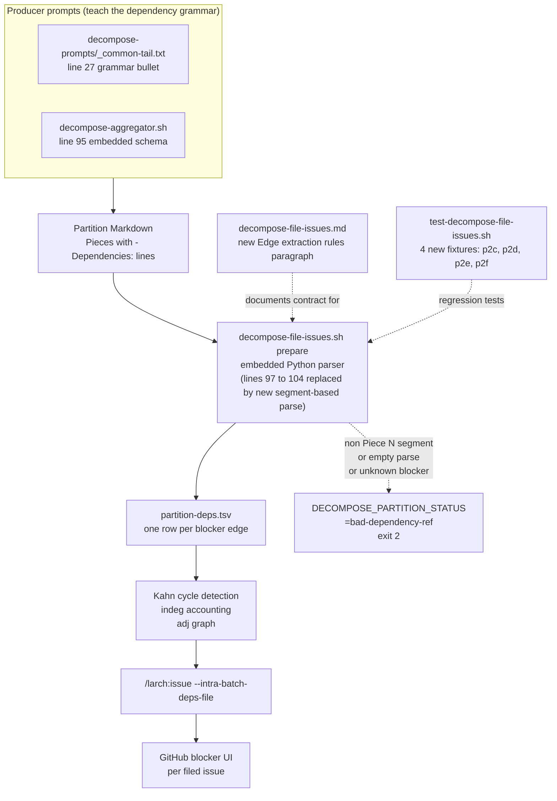

## Architecture Diagram

```mermaid
graph TD
  subgraph Producer["Producer prompts (teach the dependency grammar)"]
    common_tail["decompose-prompts/_common-tail.txt<br/>line 27 grammar bullet"]
    aggregator_prompt["decompose-aggregator.sh<br/>line 95 embedded schema"]
  end

  Producer --> partition_md["Partition Markdown<br/>Pieces with - Dependencies: lines"]

  partition_md --> parser["decompose-file-issues.sh prepare<br/>embedded Python parser<br/>(lines 97 to 104 replaced by new segment-based parse)"]

  parser --> deps_tsv["partition-deps.tsv<br/>one row per blocker edge"]
  parser -.->|"non Piece N segment<br/>or empty parse<br/>or unknown blocker"| bad_ref["DECOMPOSE_PARTITION_STATUS<br/>=bad-dependency-ref<br/>exit 2"]

  deps_tsv --> cycle["Kahn cycle detection<br/>indeg accounting<br/>adj graph"]
  cycle --> issue_filing["/larch:issue --intra-batch-deps-file"]
  issue_filing --> github_ui["GitHub blocker UI<br/>per filed issue"]

  docs["decompose-file-issues.md<br/>new Edge extraction rules paragraph"] -.->|"documents contract for"| parser

  test_harness["test-decompose-file-issues.sh<br/>4 new fixtures: p2c, p2d, p2e, p2f"] -.->|"regression tests"| parser
```
