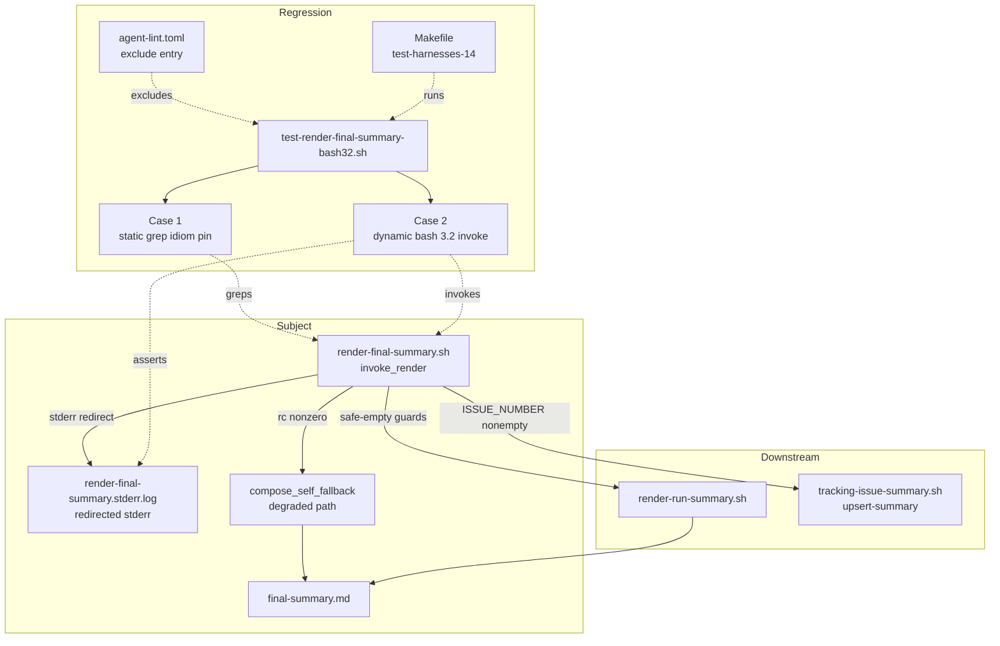

## Architecture Diagram

```mermaid
graph TD
    subgraph Subject
        RFS[render-final-summary.sh<br/>invoke_render]
        RFS_STDERR[render-final-summary.stderr.log<br/>redirected stderr]
        FALLBACK[compose_self_fallback<br/>degraded path]
        FINAL[final-summary.md]
    end

    subgraph Downstream
        RRS[render-run-summary.sh]
        TIS[tracking-issue-summary.sh<br/>upsert-summary]
    end

    subgraph Regression
        HARNESS[test-render-final-summary-bash32.sh]
        CASE1[Case 1<br/>static grep idiom pin]
        CASE2[Case 2<br/>dynamic bash 3.2 invoke]
        LINT[agent-lint.toml<br/>exclude entry]
        MAKE[Makefile<br/>test-harnesses-14]
    end

    RFS -->|safe-empty guards| RRS
    RFS -->|stderr redirect| RFS_STDERR
    RFS -->|rc nonzero| FALLBACK
    FALLBACK --> FINAL
    RRS --> FINAL
    RFS -->|ISSUE_NUMBER nonempty| TIS

    HARNESS --> CASE1
    HARNESS --> CASE2
    CASE1 -.greps.-> RFS
    CASE2 -.invokes.-> RFS
    CASE2 -.asserts.-> RFS_STDERR
    LINT -.excludes.-> HARNESS
    MAKE -.runs.-> HARNESS
```
