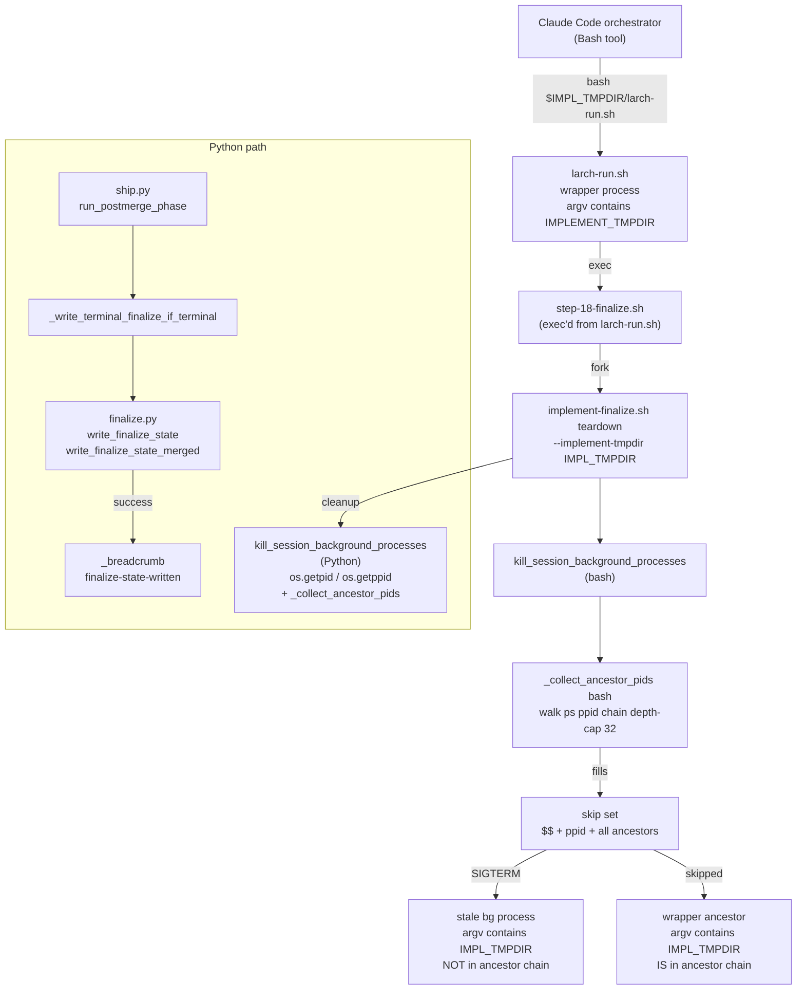

## Architecture Diagram

```mermaid
graph TD
    ORC["Claude Code orchestrator\n(Bash tool)"]
    LR["larch-run.sh\nwrapper process\nargv contains IMPLEMENT_TMPDIR"]
    S18["step-18-finalize.sh\n(exec'd from larch-run.sh)"]
    IFS["implement-finalize.sh teardown\n--implement-tmpdir IMPL_TMPDIR"]
    KSBP["kill_session_background_processes\n(bash)"]
    ANC_B["_collect_ancestor_pids bash\nwalk ps ppid chain depth-cap 32"]
    SKIP["skip set\n$$ + ppid + all ancestors"]
    STALE["stale bg process\nargv contains IMPL_TMPDIR\nNOT in ancestor chain"]
    WRAP["wrapper ancestor\nargv contains IMPL_TMPDIR\nIS in ancestor chain"]

    ORC -->|"bash $IMPL_TMPDIR/larch-run.sh"| LR
    LR -->|exec| S18
    S18 -->|fork| IFS
    IFS --> KSBP
    KSBP --> ANC_B
    ANC_B -->|"fills"| SKIP
    SKIP -->|"SIGTERM"| STALE
    SKIP -->|"skipped"| WRAP

    subgraph Python path
        SP["ship.py\nrun_postmerge_phase"]
        WTF["_write_terminal_finalize_if_terminal"]
        FIN["finalize.py\nwrite_finalize_state\nwrite_finalize_state_merged"]
        KSBP_PY["kill_session_background_processes\n(Python)\nos.getpid / os.getppid\n+ _collect_ancestor_pids"]
        BC["_breadcrumb\nfinalize-state-written"]
    end

    SP --> WTF
    WTF --> FIN
    FIN -->|success| BC
    IFS -->|cleanup| KSBP_PY
```
