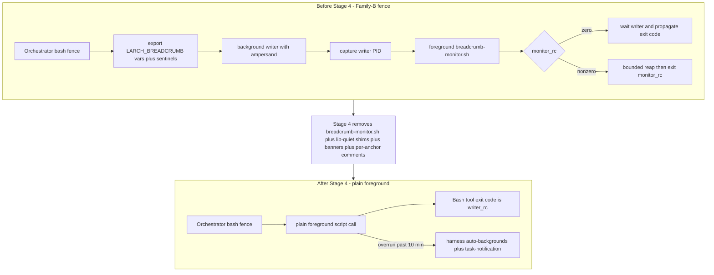

## Architecture Diagram

```mermaid
graph TD
    subgraph before["Before Stage 4 - Family-B fence"]
        b1["Orchestrator bash fence"] --> b2["export LARCH_BREADCRUMB vars plus sentinels"]
        b2 --> b3["background writer with ampersand"]
        b3 --> b4["capture writer PID"]
        b4 --> b5["foreground breadcrumb-monitor.sh"]
        b5 --> b6{"monitor_rc"}
        b6 -->|zero| b7["wait writer and propagate exit code"]
        b6 -->|nonzero| b8["bounded reap then exit monitor_rc"]
    end
    subgraph after["After Stage 4 - plain foreground"]
        a1["Orchestrator bash fence"] --> a2["plain foreground script call"]
        a2 --> a3["Bash tool exit code is writer_rc"]
        a2 -->|overrun past 10 min| a4["harness auto-backgrounds plus task-notification"]
    end
    before --> gone["Stage 4 removes breadcrumb-monitor.sh plus lib-quiet shims plus banners plus per-anchor comments"]
    gone --> after
```
