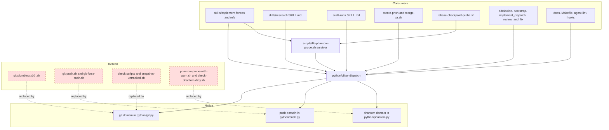

## Architecture Diagram

```mermaid
graph TD
    subgraph Consumers
        IMPL["skills/implement fences and refs"]
        RSCH["skills/research SKILL.md"]
        AUDIT["audit-runs SKILL.md"]
        PRS["create-pr.sh and merge-pr.sh"]
        RCP["rebase-checkpoint-probe.sh"]
        PYMOD["admission, bootstrap, implement_dispatch, review_and_fix"]
        DOCS["docs, Makefile, agent-lint, hooks"]
    end

    CLI["python/cli.py dispatch"]

    subgraph Native
        GIT["git domain in python/git.py"]
        PUSH["push domain in python/push.py"]
        PHANTOM["phantom domain in python/phantom.py"]
    end

    LIBPH["scripts/lib-phantom-probe.sh survivor"]

    subgraph Retired
        GITSH["git plumbing x10 .sh"]
        PUSHSH["git-push.sh and git-force-push.sh"]
        CHECKSH["check scripts and snapshot-untracked.sh"]
        PHSH["phantom-probe-with-warn.sh and check-phantom-dirty.sh"]
    end

    IMPL --> CLI
    RSCH --> CLI
    AUDIT --> CLI
    PRS --> CLI
    PYMOD --> CLI
    DOCS --> CLI
    RCP --> LIBPH
    IMPL --> LIBPH
    LIBPH --> CLI

    CLI --> GIT
    CLI --> PUSH
    CLI --> PHANTOM

    GITSH -. replaced by .-> GIT
    PUSHSH -. replaced by .-> PUSH
    CHECKSH -. replaced by .-> GIT
    PHSH -. replaced by .-> PHANTOM

    classDef deleted fill:#fdd,stroke:#900,stroke-dasharray:5 5;
    class GITSH,PUSHSH,CHECKSH,PHSH deleted;
```
