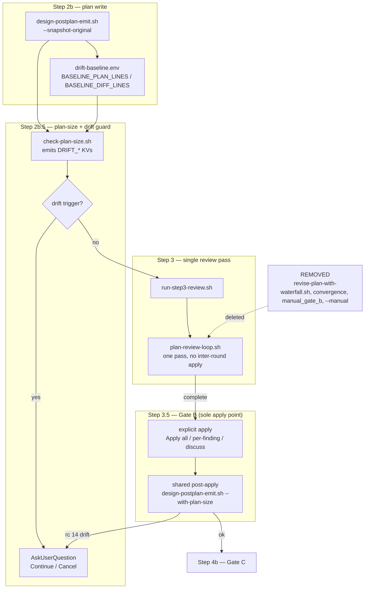

## Architecture Diagram

```mermaid
graph TD
    subgraph s2b["Step 2b — plan write"]
        PPE["design-postplan-emit.sh<br/>--snapshot-original"]
        BASE["drift-baseline.env<br/>BASELINE_PLAN_LINES / BASELINE_DIFF_LINES"]
    end
    subgraph s2b5["Step 2b.5 — plan-size + drift guard"]
        CPS["check-plan-size.sh<br/>emits DRIFT_* KVs"]
        DRIFT{"drift trigger?"}
        ASK["AskUserQuestion<br/>Continue / Cancel"]
    end
    subgraph s3["Step 3 — single review pass"]
        RUN["run-step3-review.sh"]
        LOOP["plan-review-loop.sh<br/>one pass, no inter-round apply"]
    end
    subgraph s35["Step 3.5 — Gate B (sole apply point)"]
        GB["explicit apply<br/>Apply all / per-finding / discuss"]
        POST["shared post-apply<br/>design-postplan-emit.sh --with-plan-size"]
    end
    REMOVED["REMOVED<br/>revise-plan-with-waterfall.sh, convergence, manual_gate_b, --manual"]

    PPE --> BASE
    PPE --> CPS
    BASE --> CPS
    CPS --> DRIFT
    DRIFT -->|yes| ASK
    DRIFT -->|no| RUN
    RUN --> LOOP
    LOOP -->|complete| GB
    GB --> POST
    POST -->|rc 14 drift| ASK
    POST -->|ok| GATEC["Step 4b — Gate C"]
    REMOVED -.->|deleted| LOOP
```
