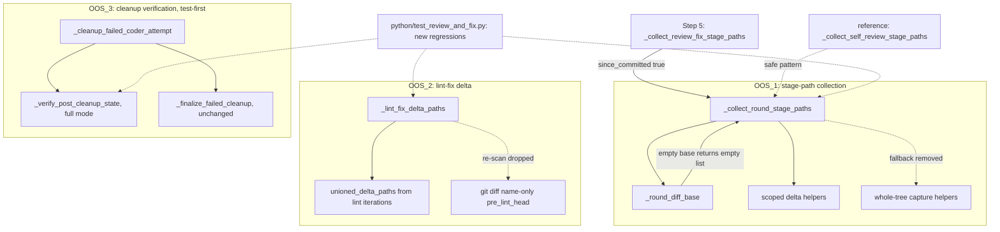

## Architecture Diagram

```mermaid
graph TD
    CRFSP["Step 5: _collect_review_fix_stage_paths"]

    subgraph oos1["OOS_1: stage-path collection"]
        CRSP["_collect_round_stage_paths"]
        RDB["_round_diff_base"]
        SCOPED["scoped delta helpers"]
        WHOLE["whole-tree capture helpers"]
    end

    subgraph oos2["OOS_2: lint-fix delta"]
        LFDP["_lint_fix_delta_paths"]
        UNIONED["unioned_delta_paths from lint iterations"]
        RESCAN["git diff name-only pre_lint_head"]
    end

    subgraph oos3["OOS_3: cleanup verification, test-first"]
        CFCA["_cleanup_failed_coder_attempt"]
        VPCS["_verify_post_cleanup_state, full mode"]
        FFC["_finalize_failed_cleanup, unchanged"]
    end

    REF["reference: _collect_self_review_stage_paths"]
    TESTS["python/test_review_and_fix.py: new regressions"]

    CRFSP -->|since_committed true| CRSP
    CRSP --> RDB
    CRSP --> SCOPED
    CRSP -.->|fallback removed| WHOLE
    RDB -->|empty base returns empty list| CRSP
    REF -.->|safe pattern| CRSP

    LFDP --> UNIONED
    LFDP -.->|re-scan dropped| RESCAN

    CFCA --> VPCS
    CFCA --> FFC

    TESTS -.-> CRSP
    TESTS -.-> LFDP
    TESTS -.-> VPCS
```
