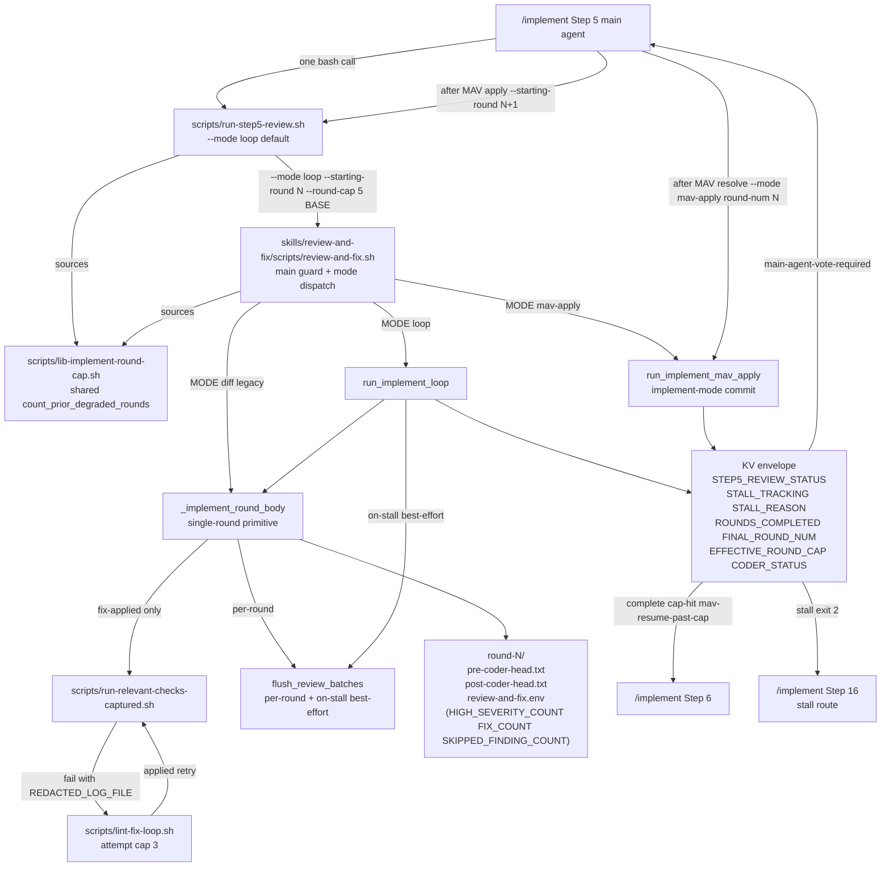

## Architecture Diagram

```mermaid
graph TD
  MainAgent["/implement Step 5 main agent"]
  Launcher["scripts/run-step5-review.sh<br/>--mode loop default"]
  Lib["scripts/lib-implement-round-cap.sh<br/>shared count_prior_degraded_rounds"]
  ReviewAndFix["skills/review-and-fix/scripts/review-and-fix.sh<br/>main guard + mode dispatch"]
  Loop["run_implement_loop"]
  Body["_implement_round_body<br/>single-round primitive"]
  MAV["run_implement_mav_apply<br/>implement-mode commit"]
  Checks["scripts/run-relevant-checks-captured.sh"]
  LintFix["scripts/lint-fix-loop.sh<br/>attempt cap 3"]
  Flush["flush_review_batches<br/>per-round + on-stall best-effort"]
  RoundDir["round-N/<br/>pre-coder-head.txt<br/>post-coder-head.txt<br/>review-and-fix.env<br/>(HIGH_SEVERITY_COUNT FIX_COUNT SKIPPED_FINDING_COUNT)"]
  Envelope["KV envelope<br/>STEP5_REVIEW_STATUS<br/>STALL_TRACKING STALL_REASON<br/>ROUNDS_COMPLETED FINAL_ROUND_NUM<br/>EFFECTIVE_ROUND_CAP CODER_STATUS"]
  Step6["/implement Step 6"]
  Step16["/implement Step 16<br/>stall route"]

  MainAgent -->|"one bash call"| Launcher
  Launcher -->|"sources"| Lib
  Launcher -->|"--mode loop --starting-round N --round-cap 5 BASE"| ReviewAndFix
  ReviewAndFix -->|"sources"| Lib
  ReviewAndFix -->|"MODE loop"| Loop
  ReviewAndFix -->|"MODE diff legacy"| Body
  ReviewAndFix -->|"MODE mav-apply"| MAV
  Loop --> Body
  Body --> RoundDir
  Body -->|"fix-applied only"| Checks
  Checks -->|"fail with REDACTED_LOG_FILE"| LintFix
  LintFix -->|"applied retry"| Checks
  Body -->|"per-round"| Flush
  Loop -->|"on-stall best-effort"| Flush
  Loop --> Envelope
  MAV --> Envelope
  Envelope -->|"complete cap-hit mav-resume-past-cap"| Step6
  Envelope -->|"stall exit 2"| Step16
  Envelope -->|"main-agent-vote-required"| MainAgent
  MainAgent -->|"after MAV resolve --mode mav-apply round-num N"| MAV
  MainAgent -->|"after MAV apply --starting-round N+1"| Launcher
```
