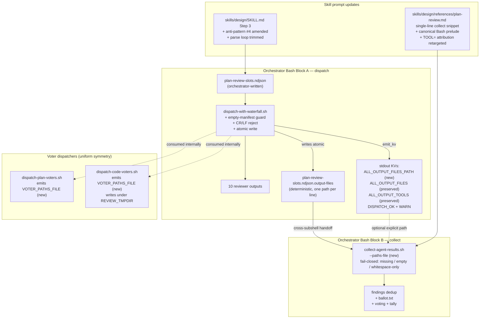

## Architecture Diagram

```mermaid
graph TD
    subgraph "Orchestrator Bash Block A — dispatch"
        Manifest["plan-review-slots.ndjson<br/>(orchestrator-written)"]
        Disp["dispatch-with-waterfall.sh<br/>+ empty-manifest guard<br/>+ CR/LF reject<br/>+ atomic write"]
        Outputs["10 reviewer outputs"]
        PathsFile["plan-review-slots.ndjson.output-files<br/>(deterministic, one path per line)"]
        Stdout["stdout KVs:<br/>ALL_OUTPUT_FILES_PATH (new)<br/>ALL_OUTPUT_FILES (preserved)<br/>ALL_OUTPUT_TOOLS (preserved)<br/>DISPATCH_OK + WARN"]
        Manifest --> Disp
        Disp --> Outputs
        Disp -->|writes atomic| PathsFile
        Disp -->|emit_kv| Stdout
    end

    subgraph "Orchestrator Bash Block B — collect"
        Collect["collect-agent-results.sh<br/>--paths-file (new)<br/>fail-closed: missing / empty / whitespace-only"]
        Findings["findings dedup<br/>+ ballot.txt<br/>+ voting + tally"]
        Collect --> Findings
    end

    PathsFile -->|cross-subshell handoff| Collect
    Stdout -.optional explicit path.-> Collect

    subgraph "Voter dispatchers (uniform symmetry)"
        DPV["dispatch-plan-voters.sh<br/>emits VOTER_PATHS_FILE (new)"]
        DCV["dispatch-code-voters.sh<br/>emits VOTER_PATHS_FILE (new)<br/>writes under REVIEW_TMPDIR"]
    end

    Disp -.consumed internally.-> DPV
    Disp -.consumed internally.-> DCV

    subgraph "Skill prompt updates"
        SkillMD["skills/design/SKILL.md Step 3<br/>+ anti-pattern #4 amended<br/>+ parse loop trimmed"]
        PlanRevMD["skills/design/references/plan-review.md<br/>single-line collect snippet<br/>+ canonical Bash prelude<br/>+ TOOL= attribution retargeted"]
    end

    SkillMD --> Manifest
    PlanRevMD --> Collect
```
