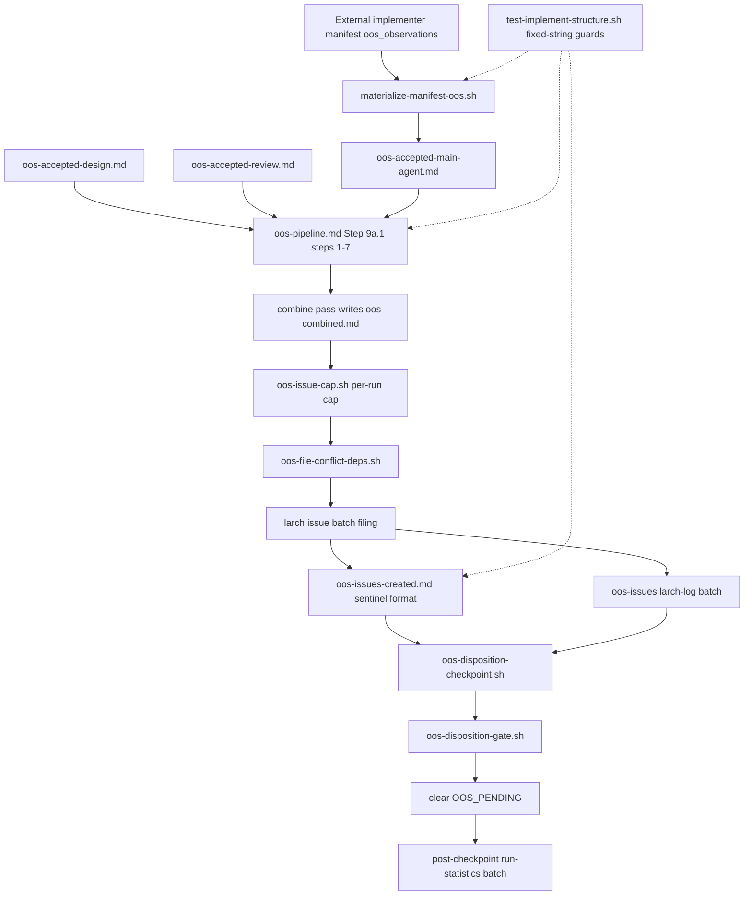

## Architecture Diagram

```mermaid
graph TD
    MANIFEST[External implementer manifest oos_observations] --> MAT[materialize-manifest-oos.sh]
    MAT --> MAIN[oos-accepted-main-agent.md]
    DESIGN[oos-accepted-design.md] --> PIPE[oos-pipeline.md Step 9a.1 steps 1-7]
    REVIEW[oos-accepted-review.md] --> PIPE
    MAIN --> PIPE
    PIPE --> COMBINE[combine pass writes oos-combined.md]
    COMBINE --> CAP[oos-issue-cap.sh per-run cap]
    CAP --> CONFLICT[oos-file-conflict-deps.sh]
    CONFLICT --> ISSUE[larch issue batch filing]
    ISSUE --> SENTINEL[oos-issues-created.md sentinel format]
    ISSUE --> LOG[oos-issues larch-log batch]
    SENTINEL --> CHECK[oos-disposition-checkpoint.sh]
    LOG --> CHECK
    CHECK --> GATE[oos-disposition-gate.sh]
    GATE --> CLEAR[clear OOS_PENDING]
    CLEAR --> STATS[post-checkpoint run-statistics batch]
    GUARD[test-implement-structure.sh fixed-string guards] -.-> PIPE
    GUARD -.-> MAT
    GUARD -.-> SENTINEL
```
