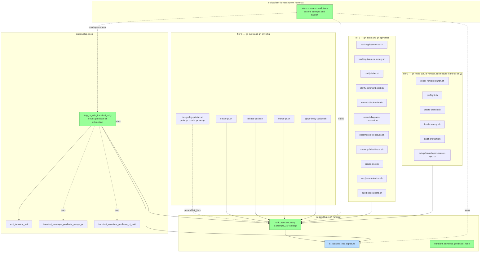

## Architecture Diagram

Notes:
- Green: new code (lifted helper, lifted predicate, ship-pr thin wrapper, test harness).
- Blue: existing `is_transient_net_signature()` (byte-stable).
- Solid arrows: function calls. Dotted: usage relationships.
- `gh issue create` and `git clone` callsites are intentionally NOT wired to `with_transient_retry` (non-idempotent — Findings 4 and 6) and stay bare in their parent scripts.
