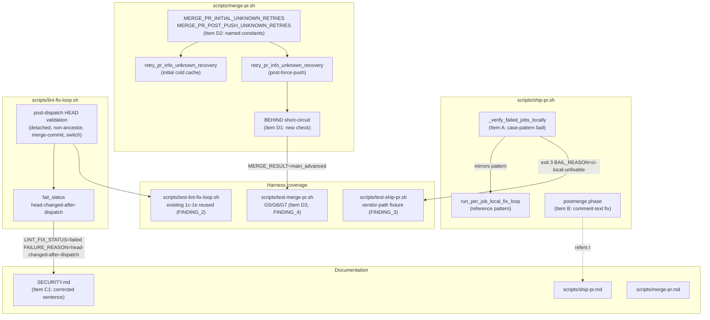

## Architecture Diagram

```mermaid
flowchart TD
    subgraph ship_pr["scripts/ship-pr.sh"]
        verify["_verify_failed_jobs_locally<br/>(Item A: case-pattern bail)"]
        runper["run_per_job_local_fix_loop<br/>(reference pattern)"]
        postmerge["postmerge phase<br/>(Item B: comment-text fix)"]
    end

    subgraph merge_pr["scripts/merge-pr.sh"]
        retry_init["retry_pr_info_unknown_recovery<br/>(initial cold cache)"]
        retry_post["retry_pr_info_unknown_recovery<br/>(post-force-push)"]
        behind_check["BEHIND short-circuit<br/>(Item D1: new check)"]
        constants["MERGE_PR_INITIAL_UNKNOWN_RETRIES<br/>MERGE_PR_POST_PUSH_UNKNOWN_RETRIES<br/>(Item D2: named constants)"]
    end

    subgraph lint_fix["scripts/lint-fix-loop.sh"]
        fail_status["fail_status<br/>head-changed-after-dispatch"]
        head_check["post-dispatch HEAD validation<br/>(detached, non-ancestor, merge-commit, switch)"]
    end

    subgraph tests["Harness coverage"]
        test_merge["scripts/test-merge-pr.sh<br/>G5/G6/G7 (Item D3, FINDING_4)"]
        test_ship["scripts/test-ship-pr.sh<br/>vendor-path fixture (FINDING_3)"]
        test_lint["scripts/test-lint-fix-loop.sh<br/>existing 1c-1e reused (FINDING_2)"]
    end

    subgraph docs["Documentation"]
        sec_md["SECURITY.md<br/>(Item C1: corrected sentence)"]
        ship_md["scripts/ship-pr.md"]
        merge_md["scripts/merge-pr.md"]
    end

    verify -->|mirrors pattern| runper
    verify -->|exit 3 BAIL_REASON=ci-local-unfixable| test_ship
    constants --> retry_init
    constants --> retry_post
    retry_post --> behind_check
    behind_check -->|MERGE_RESULT=main_advanced| test_merge
    head_check --> fail_status
    fail_status -->|LINT_FIX_STATUS=failed FAILURE_REASON=head-changed-after-dispatch| sec_md
    head_check --> test_lint
    postmerge -.refers to.-> ship_md
```
