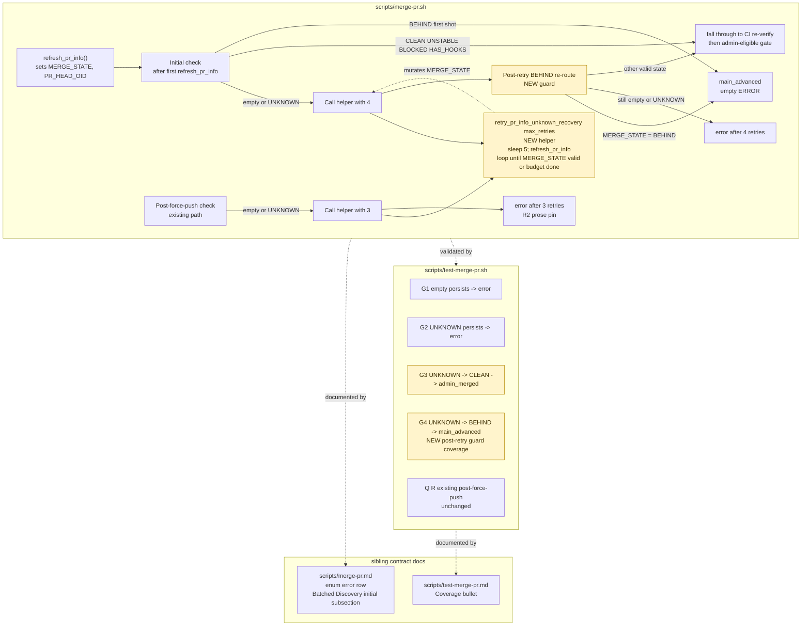

## Architecture Diagram

```mermaid
flowchart TD
    subgraph mergePr["scripts/merge-pr.sh"]
        rpi["refresh_pr_info()<br/>sets MERGE_STATE, PR_HEAD_OID"]
        helper["retry_pr_info_unknown_recovery max_retries<br/>NEW helper<br/>sleep 5; refresh_pr_info<br/>loop until MERGE_STATE valid or budget done"]

        initialCheck["Initial check<br/>after first refresh_pr_info"]
        initialRetry["Call helper with 4"]
        behindReroute["Post-retry BEHIND re-route<br/>NEW guard"]
        initialError["error after 4 retries"]
        fallThrough["fall through to CI re-verify<br/>then admin-eligible gate"]

        forceCheck["Post-force-push check<br/>existing path"]
        forceRetry["Call helper with 3"]
        forceError["error after 3 retries<br/>R2 prose pin"]

        rpi --> initialCheck
        initialCheck -->|empty or UNKNOWN| initialRetry
        initialCheck -->|CLEAN UNSTABLE BLOCKED HAS_HOOKS| fallThrough
        initialCheck -->|BEHIND first shot| mainAdvancedFast["main_advanced<br/>empty ERROR"]
        initialRetry --> helper
        helper -. mutates MERGE_STATE .-> initialRetry
        initialRetry --> behindReroute
        behindReroute -->|MERGE_STATE = BEHIND| mainAdvancedFast
        behindReroute -->|still empty or UNKNOWN| initialError
        behindReroute -->|other valid state| fallThrough

        forceCheck -->|empty or UNKNOWN| forceRetry
        forceRetry --> helper
        forceRetry --> forceError
    end

    subgraph tests["scripts/test-merge-pr.sh"]
        g1["G1 empty persists -> error"]
        g2["G2 UNKNOWN persists -> error"]
        g3["G3 UNKNOWN -> CLEAN -> admin_merged"]
        g4["G4 UNKNOWN -> BEHIND -> main_advanced<br/>NEW post-retry guard coverage"]
        qr["Q R existing post-force-push<br/>unchanged"]
    end

    subgraph docs["sibling contract docs"]
        mergePrMd["scripts/merge-pr.md<br/>enum error row<br/>Batched Discovery initial subsection"]
        testMd["scripts/test-merge-pr.md<br/>Coverage bullet"]
    end

    mergePr -. validated by .-> tests
    mergePr -. documented by .-> mergePrMd
    tests -. documented by .-> testMd

    classDef new fill:#fff4cc,stroke:#b48a00,color:#3b2c00
    class helper,behindReroute,g3,g4 new
```
