## Architecture Diagram

```mermaid
graph TD
    subgraph CallSites["skills/implement/SKILL.md — 6 call sites"]
        S1["Step 1.r fence<br/>(plan materialization)"]
        S4["Step 4.r fence<br/>(commit impl)"]
        S7["Step 7.r fence<br/>(commit review)<br/>if FILES_CHANGED=true"]
        S7a["Step 7a.r fence<br/>(diagrams)"]
        SD["Step 2-post-dispatch<br/>fence"]
        SB["Step 8-pre-bump<br/>fence"]
    end

    subgraph NewWrappers["NEW wrappers (scripts/)"]
        RCP["rebase-checkpoint-probe.sh<br/>(combined wrapper)"]
        PPW["phantom-probe-with-warn.sh<br/>(standalone wrapper)"]
    end

    subgraph SharedLib["NEW shared library"]
        LPP["lib-phantom-probe.sh<br/>phantom_probe_with_warn function<br/>LARCH_LIB_PHANTOM_PROBE_LOADED guard"]
    end

    subgraph ExistingHelpers["existing scripts/ (unchanged contracts)"]
        RP["rebase-push.sh<br/>emit_kv via FD3"]
        CPD["check-phantom-dirty.sh<br/>emit_kv via FD3"]
        AEI["append-execution-issue.sh<br/>emit_kv via FD3"]
        LQ["lib-quiet.sh<br/>emit_kv / emit_breadcrumb"]
    end

    subgraph TestHarnesses["NEW test harnesses"]
        TRP["test-rebase-checkpoint-probe.sh<br/>17 cases"]
        TPP["test-phantom-probe-with-warn.sh<br/>10 cases"]
    end

    subgraph UpdatedFiles["UPDATED files"]
        SKILL["skills/implement/SKILL.md<br/>3 edit regions"]
        LFM["lint-foreground-markers.sh<br/>DENYLIST +2 entries"]
        TIRM["test-implement-rebase-macro.sh<br/>pivot C/E/G/H, add C'/J"]
        MK["Makefile<br/>.PHONY + 2 recipes<br/>+ shard assignment"]
        AL["agent-lint.toml<br/>allowlist +6 entries"]
        DL["docs/linting.md<br/>2 new bullets"]
    end

    S1 --> RCP
    S4 --> RCP
    S7 --> RCP
    S7a --> RCP
    SD --> PPW
    SB --> PPW

    RCP -->|sources| LQ
    RCP -->|sources| LPP
    RCP -->|SCRIPT_DIR invoke| RP
    RCP -->|via lib function| CPD
    RCP -->|via lib function| AEI

    PPW -->|sources| LQ
    PPW -->|sources| LPP

    LPP -->|SCRIPT_DIR invoke| CPD
    LPP -->|SCRIPT_DIR invoke| AEI
    LPP -.->|emit_kv via parent FD3| LQ

    TRP -.->|stubs| RCP
    TRP -.->|temp-dir stubs| RP
    TRP -.->|temp-dir stubs| CPD
    TRP -.->|temp-dir stubs| AEI

    TPP -.->|stubs| PPW
    TPP -.->|temp-dir stubs| CPD
    TPP -.->|temp-dir stubs| AEI

    SKILL -.->|references| RCP
    SKILL -.->|references| PPW
    LFM -.->|DENYLIST| RCP
    LFM -.->|DENYLIST| PPW
    TIRM -.->|pins invocations| SKILL
    MK -.->|targets| TRP
    MK -.->|targets| TPP
    AL -.->|allowlists| LPP
    AL -.->|allowlists| TRP
    AL -.->|allowlists| TPP

    classDef new fill:#bfb,stroke:#080,stroke-width:2px
    classDef updated fill:#bbf,stroke:#008,stroke-width:1px
    classDef existing fill:#eee,stroke:#888,stroke-width:1px
    classDef site fill:#fea,stroke:#a80,stroke-width:1px

    class RCP,PPW,LPP,TRP,TPP new
    class SKILL,LFM,TIRM,MK,AL,DL updated
    class RP,CPD,AEI,LQ existing
    class S1,S4,S7,S7a,SD,SB site
```

Legend: green = new artifacts (5 new files); blue = updated files (6 files); grey = existing helpers (unchanged contracts); orange = the 6 SKILL.md call-site fences. Solid arrows are runtime invocations; dotted arrows are configuration / test / lint references.
