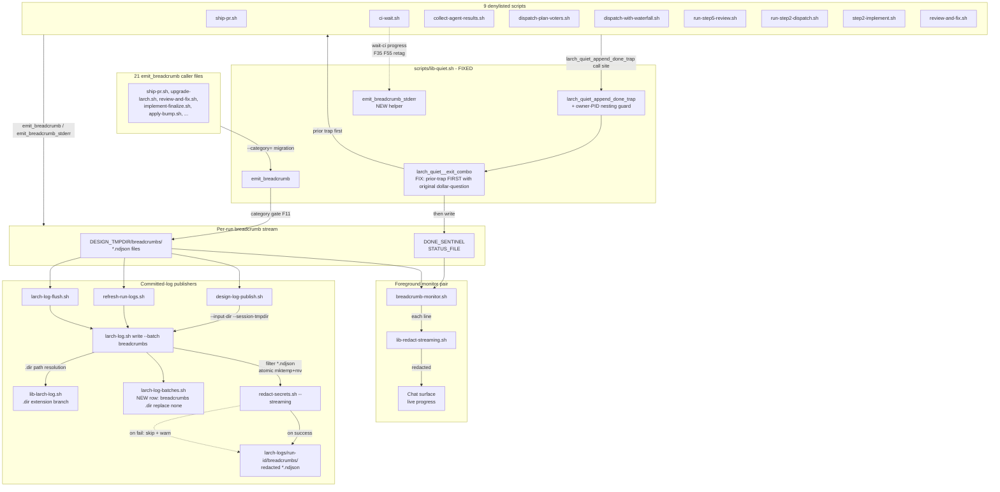

## Architecture Diagram

```mermaid
graph TD
    subgraph Producers [9 denylisted scripts]
        ship[ship-pr.sh]
        ciwait[ci-wait.sh]
        collect[collect-agent-results.sh]
        dispvote[dispatch-plan-voters.sh]
        dispwf[dispatch-with-waterfall.sh]
        rs5r[run-step5-review.sh]
        rs2d[run-step2-dispatch.sh]
        s2impl[step2-implement.sh]
        raf[review-and-fix.sh]
    end

    subgraph Library [scripts/lib-quiet.sh - FIXED]
        appendtrap[larch_quiet_append_done_trap<br/>+ owner-PID nesting guard]
        excombo[larch_quiet__exit_combo<br/>FIX: prior-trap FIRST with original dollar-question]
        embcrumb[emit_breadcrumb]
        embstderr[emit_breadcrumb_stderr<br/>NEW helper]
    end

    subgraph Stream [Per-run breadcrumb stream]
        ndjson[DESIGN_TMPDIR/breadcrumbs/<br/>*.ndjson files]
        sentinel[DONE_SENTINEL<br/>STATUS_FILE]
    end

    subgraph Monitor [Foreground monitor pair]
        bcmon[breadcrumb-monitor.sh]
        libredact[lib-redact-streaming.sh]
        chat[Chat surface<br/>live progress]
    end

    subgraph Persistence [Committed-log publishers]
        dlp[design-log-publish.sh]
        rrl[refresh-run-logs.sh]
        lf[larch-log-flush.sh]
        llog[larch-log.sh write --batch breadcrumbs]
        libllog[lib-larch-log.sh<br/>.dir extension branch]
        llb[larch-log-batches.sh<br/>NEW row: breadcrumbs .dir replace none]
        redact[redact-secrets.sh --streaming]
        committed[larch-logs/run-id/breadcrumbs/<br/>redacted *.ndjson]
    end

    subgraph Migration [21 emit_breadcrumb caller files]
        callers[ship-pr.sh, upgrade-larch.sh, review-and-fix.sh,<br/>implement-finalize.sh, apply-bump.sh, ...]
    end

    Producers -->|larch_quiet_append_done_trap call site| appendtrap
    appendtrap --> excombo
    excombo -->|prior trap first| Producers
    excombo -->|then write| sentinel
    Producers -->|emit_breadcrumb / emit_breadcrumb_stderr| Stream
    ciwait -.->|wait-ci progress<br/>F35 F55 retag| embstderr

    Migration -->|--category= migration| embcrumb
    embcrumb -->|category gate F11| ndjson

    sentinel --> bcmon
    ndjson --> bcmon
    bcmon -->|each line| libredact
    libredact -->|redacted| chat

    ndjson --> dlp
    ndjson --> rrl
    ndjson --> lf
    dlp -->|--input-dir --session-tmpdir| llog
    rrl --> llog
    lf --> llog
    llog -->|.dir path resolution| libllog
    llog --> llb
    llog -->|filter *.ndjson<br/>atomic mktemp+mv| redact
    redact -->|on success| committed
    redact -.->|on fail: skip + warn| committed
```
