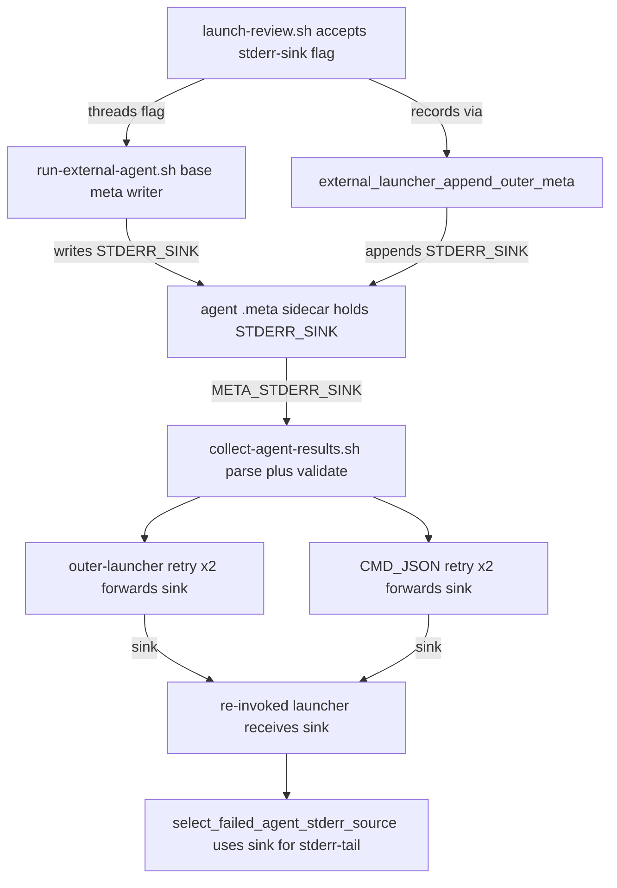

## Architecture Diagram

```mermaid
graph TD
    LR["launch-review.sh accepts stderr-sink flag"]
    REA["run-external-agent.sh base meta writer"]
    APP["external_launcher_append_outer_meta"]
    META["agent .meta sidecar holds STDERR_SINK"]
    COL["collect-agent-results.sh parse plus validate"]
    OUTER["outer-launcher retry x2 forwards sink"]
    CMDJSON["CMD_JSON retry x2 forwards sink"]
    REINV["re-invoked launcher receives sink"]
    SEL["select_failed_agent_stderr_source uses sink for stderr-tail"]

    LR -->|threads flag| REA
    LR -->|records via| APP
    REA -->|writes STDERR_SINK| META
    APP -->|appends STDERR_SINK| META
    META -->|META_STDERR_SINK| COL
    COL --> OUTER
    COL --> CMDJSON
    OUTER -->|sink| REINV
    CMDJSON -->|sink| REINV
    REINV --> SEL
```
