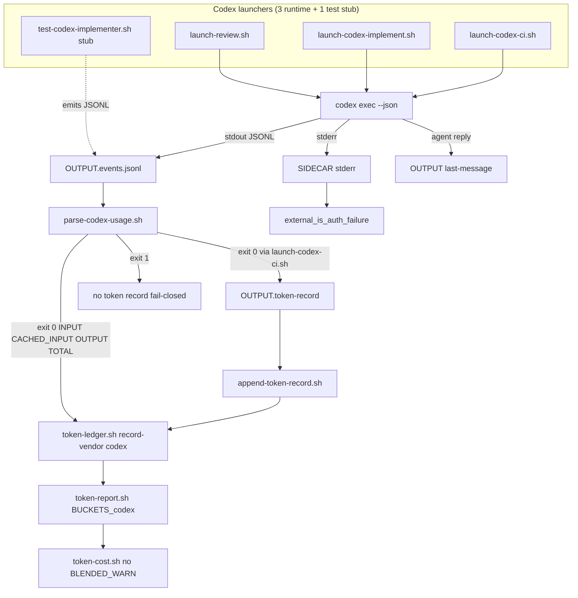

## Architecture Diagram

```mermaid
flowchart TD
  subgraph Launchers["Codex launchers (3 runtime + 1 test stub)"]
    LR[launch-review.sh]
    LCI[launch-codex-implement.sh]
    LCC[launch-codex-ci.sh]
    TCI[test-codex-implementer.sh stub]
  end

  CODEX["codex exec --json"]
  EVENTS[OUTPUT.events.jsonl]
  SIDECAR[SIDECAR stderr]
  TRANSCRIPT[OUTPUT last-message]

  LR --> CODEX
  LCI --> CODEX
  LCC --> CODEX
  TCI -. emits JSONL .-> EVENTS

  CODEX -- stdout JSONL --> EVENTS
  CODEX -- stderr --> SIDECAR
  CODEX -- agent reply --> TRANSCRIPT

  HELPER[parse-codex-usage.sh]
  EVENTS --> HELPER

  LEDGER[token-ledger.sh record-vendor codex]
  RECORD[OUTPUT.token-record]
  APPEND[append-token-record.sh]
  NOOP[no token record fail-closed]

  HELPER -- exit 0 INPUT CACHED_INPUT OUTPUT TOTAL --> LEDGER
  HELPER -- exit 0 via launch-codex-ci.sh --> RECORD
  RECORD --> APPEND
  APPEND --> LEDGER
  HELPER -- exit 1 --> NOOP

  AUTH[external_is_auth_failure]
  SIDECAR --> AUTH

  REPORT[token-report.sh BUCKETS_codex]
  COST[token-cost.sh no BLENDED_WARN]
  LEDGER --> REPORT --> COST
```
