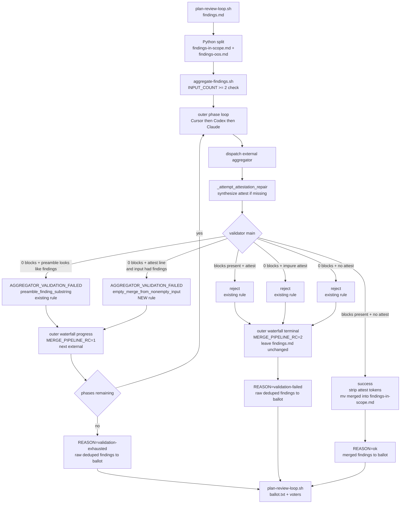

## Architecture Diagram

```mermaid
flowchart TD
    A[plan-review-loop.sh<br/>findings.md] --> B[Python split<br/>findings-in-scope.md +<br/>findings-oos.md]
    B --> C[aggregate-findings.sh<br/>INPUT_COUNT >= 2 check]
    C --> D[outer phase loop<br/>Cursor then Codex then Claude]
    D --> E[dispatch external aggregator]
    E --> F[_attempt_attestation_repair<br/>synthesize attest if missing]
    F --> G{validator main}
    G -->|blocks present + attest| H[reject<br/>existing rule]
    G -->|0 blocks + impure attest| I[reject<br/>existing rule]
    G -->|0 blocks + preamble looks like findings| J[AGGREGATOR_VALIDATION_FAILED<br/>preamble_finding_substring<br/>existing rule]
    G -->|0 blocks + no attest| K[reject<br/>existing rule]
    G -->|0 blocks + attest line<br/>and input had findings| L[AGGREGATOR_VALIDATION_FAILED<br/>empty_merge_from_nonempty_input<br/>NEW rule]
    G -->|blocks present + no attest| M[success<br/>strip attest tokens<br/>mv merged into findings-in-scope.md]
    J --> N[outer waterfall progress<br/>MERGE_PIPELINE_RC=1<br/>next external]
    L --> N
    H --> O[outer waterfall terminal<br/>MERGE_PIPELINE_RC=2<br/>leave findings.md unchanged]
    I --> O
    K --> O
    N --> P{phases remaining}
    P -->|yes| D
    P -->|no| Q[REASON=validation-exhausted<br/>raw deduped findings to ballot]
    O --> R[REASON=validation-failed<br/>raw deduped findings to ballot]
    M --> S[REASON=ok<br/>merged findings to ballot]
    Q --> T[plan-review-loop.sh<br/>ballot.txt + voters]
    R --> T
    S --> T
```
