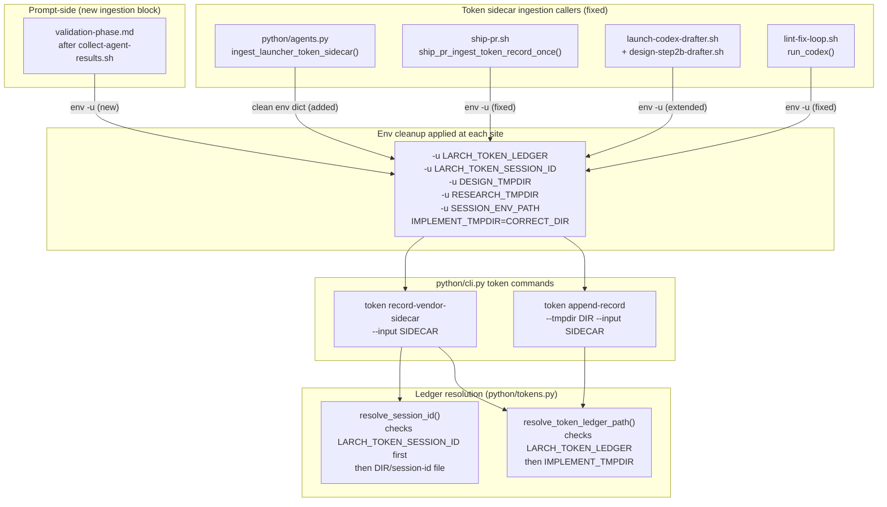

## Architecture Diagram

```mermaid
graph TD
    subgraph callers["Token sidecar ingestion callers (fixed)"]
        LFL["lint-fix-loop.sh\nrun_codex()"]
        DRAFTER["launch-codex-drafter.sh\n+ design-step2b-drafter.sh"]
        SHIP["ship-pr.sh\nship_pr_ingest_token_record_once()"]
        AGENTS["python/agents.py\ningest_launcher_token_sidecar()"]
    end

    subgraph validation["Prompt-side (new ingestion block)"]
        VAL["validation-phase.md\nafter collect-agent-results.sh"]
    end

    subgraph env_fix["Env cleanup applied at each site"]
        UNSET["-u LARCH_TOKEN_LEDGER\n-u LARCH_TOKEN_SESSION_ID\n-u DESIGN_TMPDIR\n-u RESEARCH_TMPDIR\n-u SESSION_ENV_PATH\nIMPLEMENT_TMPDIR=CORRECT_DIR"]
    end

    subgraph cmds["python/cli.py token commands"]
        AR["token append-record\n--tmpdir DIR --input SIDECAR"]
        RVS["token record-vendor-sidecar\n--input SIDECAR"]
    end

    subgraph ledger["Ledger resolution (python/tokens.py)"]
        RSI["resolve_session_id()\nchecks LARCH_TOKEN_SESSION_ID first\nthen DIR/session-id file"]
        RLP["resolve_token_ledger_path()\nchecks LARCH_TOKEN_LEDGER\nthen IMPLEMENT_TMPDIR"]
    end

    LFL -->|"env -u (fixed)"| UNSET
    DRAFTER -->|"env -u (extended)"| UNSET
    SHIP -->|"env -u (fixed)"| UNSET
    AGENTS -->|"clean env dict (added)"| UNSET
    VAL -->|"env -u (new)"| UNSET

    UNSET --> AR
    UNSET --> RVS

    AR --> RLP
    RVS --> RSI
    RVS --> RLP
```
