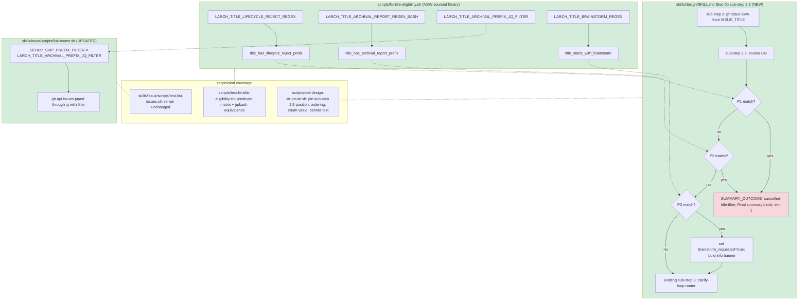

## Architecture Diagram

```mermaid
flowchart TD
    subgraph LIB["scripts/lib-title-eligibility.sh (NEW sourced library)"]
        G1["LARCH_TITLE_LIFECYCLE_REJECT_REGEX"]
        G2["LARCH_TITLE_ARCHIVAL_REPORT_REGEX_BASH"]
        G3["LARCH_TITLE_ARCHIVAL_PREFIX_JQ_FILTER"]
        G4["LARCH_TITLE_BRAINSTORM_REGEX"]
        P1["title_has_lifecycle_reject_prefix"]
        P2["title_has_archival_report_prefix"]
        P3["title_starts_with_brainstorm"]
        G1 --> P1
        G2 --> P2
        G4 --> P3
    end

    subgraph DESIGN["skills/design/SKILL.md Step 0b sub-step 2.5 (NEW)"]
        D1["sub-step 2: gh issue view fetch ISSUE_TITLE"]
        D2["sub-step 2.5: source LIB"]
        D3{"P1 match?"}
        D4{"P2 match?"}
        D5{"P3 match?"}
        D6["set brainstorm_requested=true; bold info banner"]
        D7["existing sub-step 3: clarify-loop router"]
        DEXIT["SUMMARY_OUTCOME=cancelled-title-filter; Final summary block; exit 1"]
        D1 --> D2
        D2 --> D3
        D3 -- yes --> DEXIT
        D3 -- no --> D4
        D4 -- yes --> DEXIT
        D4 -- no --> D5
        D5 -- yes --> D6
        D5 -- no --> D7
        D6 --> D7
    end

    subgraph ISSUE["skills/issue/scripts/list-issues.sh (UPDATED)"]
        L1["DEDUP_SKIP_PREFIX_FILTER = LARCH_TITLE_ARCHIVAL_PREFIX_JQ_FILTER"]
        L2["gh api issues piped through jq with filter"]
    end

    P1 -.-> D3
    P2 -.-> D4
    P3 -.-> D5
    G3 -.-> L1
    L1 --> L2

    subgraph TESTS["regression coverage"]
        T1["scripts/test-lib-title-eligibility.sh: predicate matrix + jq/bash equivalence"]
        T2["scripts/test-design-structure.sh: pin sub-step 2.5 position, ordering, enum value, banner text"]
        T3["skills/issue/scripts/test-list-issues.sh: re-run unchanged"]
    end

    LIB -.- T1
    DESIGN -.- T2
    ISSUE -.- T3

    style LIB fill:#d4edda
    style DESIGN fill:#d4edda
    style ISSUE fill:#d4edda
    style DEXIT fill:#f8d7da
```
