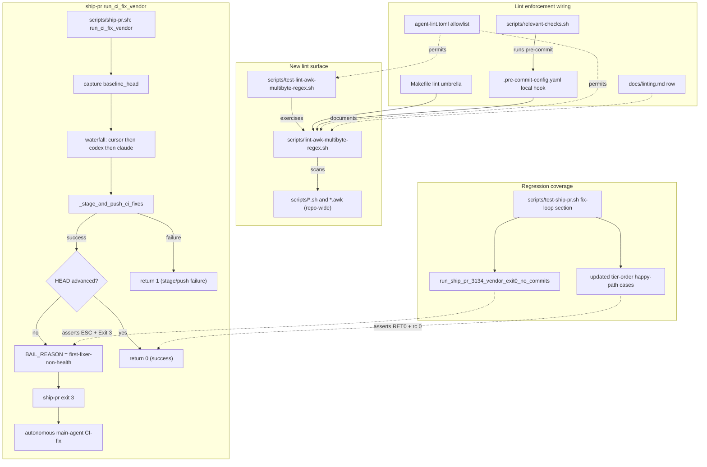

## Architecture Diagram

```mermaid
graph TD
    subgraph "New lint surface"
        LINT["scripts/lint-awk-multibyte-regex.sh"]
        LTEST["scripts/test-lint-awk-multibyte-regex.sh"]
        SCAN["scripts/*.sh and *.awk (repo-wide)"]
        LINT -- scans --> SCAN
        LTEST -- exercises --> LINT
    end

    subgraph "Lint enforcement wiring"
        MK["Makefile lint umbrella"]
        PC[".pre-commit-config.yaml local hook"]
        AL["agent-lint.toml allowlist"]
        DOC["docs/linting.md row"]
        RC["scripts/relevant-checks.sh"]
    end

    MK --> LINT
    PC --> LINT
    RC -- runs pre-commit --> PC
    AL -. permits .-> LINT
    AL -. permits .-> LTEST
    DOC -. documents .-> LINT

    subgraph "ship-pr run_ci_fix_vendor"
        SP["scripts/ship-pr.sh: run_ci_fix_vendor"]
        BH["capture baseline_head"]
        WL["waterfall: cursor then codex then claude"]
        SPF["_stage_and_push_ci_fixes"]
        HD{"HEAD advanced?"}
        ESC["BAIL_REASON = first-fixer-non-health"]
        RET0["return 0 (success)"]
        RET1["return 1 (stage/push failure)"]
        EX3["ship-pr exit 3"]
        AM["autonomous main-agent CI-fix"]
        SP --> BH
        BH --> WL
        WL --> SPF
        SPF -- success --> HD
        SPF -- failure --> RET1
        HD -- yes --> RET0
        HD -- no --> ESC
        ESC --> EX3
        EX3 --> AM
    end

    subgraph "Regression coverage"
        FIXLOOP["scripts/test-ship-pr.sh fix-loop section"]
        NEWCASE["run_ship_pr_3134_vendor_exit0_no_commits"]
        UPDCASES["updated tier-order happy-path cases"]
        FIXLOOP --> NEWCASE
        FIXLOOP --> UPDCASES
        NEWCASE -. asserts ESC + Exit 3 .-> ESC
        UPDCASES -. asserts RET0 + rc 0 .-> RET0
    end
```
