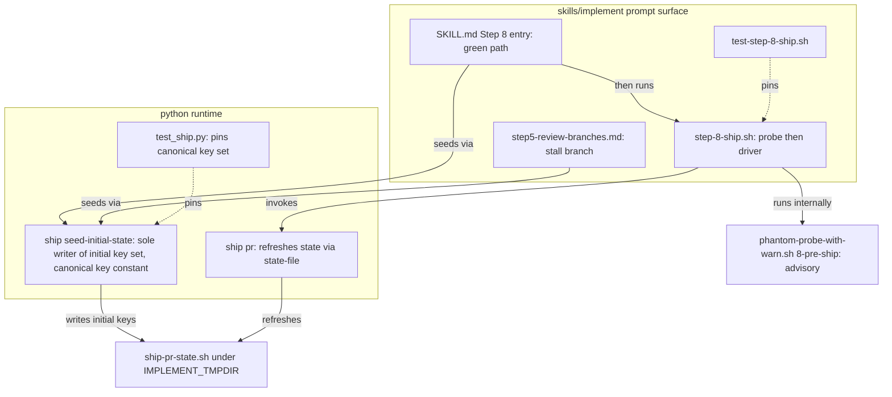

## Architecture Diagram

```mermaid
graph TD
    subgraph py["python runtime"]
        SEED["ship seed-initial-state: sole writer of initial key set, canonical key constant"]
        SHIP["ship pr: refreshes state via state-file"]
        TEST["test_ship.py: pins canonical key set"]
    end

    subgraph impl["skills/implement prompt surface"]
        STEP8["SKILL.md Step 8 entry: green path"]
        STALL["step5-review-branches.md: stall branch"]
        WRAP["step-8-ship.sh: probe then driver"]
        SHARNESS["test-step-8-ship.sh"]
    end

    PROBE["phantom-probe-with-warn.sh 8-pre-ship: advisory"]
    STATE["ship-pr-state.sh under IMPLEMENT_TMPDIR"]

    STEP8 -->|seeds via| SEED
    STALL -->|seeds via| SEED
    SEED -->|writes initial keys| STATE
    STEP8 -->|then runs| WRAP
    WRAP -->|runs internally| PROBE
    WRAP -->|invokes| SHIP
    SHIP -->|refreshes| STATE
    TEST -.pins.-> SEED
    SHARNESS -.pins.-> WRAP
```
