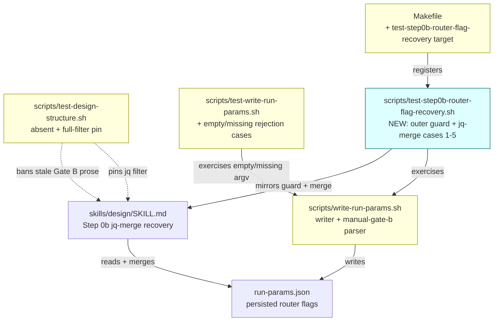

## Architecture Diagram

```mermaid
graph TD
    SKILL[skills/design/SKILL.md<br/>Step 0b jq-merge recovery]
    WRITER[scripts/write-run-params.sh<br/>writer + manual-gate-b parser]
    RUNPARAMS[run-params.json<br/>persisted router flags]

    LINT[scripts/test-design-structure.sh<br/>absent + full-filter pin]
    WRITER_TEST[scripts/test-write-run-params.sh<br/>+ empty/missing rejection cases]
    RECOVERY_TEST[scripts/test-step0b-router-flag-recovery.sh<br/>NEW: outer guard + jq-merge cases 1-5]
    MK[Makefile<br/>+ test-step0b-router-flag-recovery target]

    WRITER -->|writes| RUNPARAMS
    SKILL -->|reads + merges| RUNPARAMS

    LINT -.->|pins jq filter| SKILL
    LINT -.->|bans stale Gate B prose| SKILL
    WRITER_TEST -->|exercises empty/missing argv| WRITER
    RECOVERY_TEST -->|exercises| WRITER
    RECOVERY_TEST -->|mirrors guard + merge| SKILL
    MK -->|registers| RECOVERY_TEST

    classDef new fill:#dff,stroke:#066
    classDef updated fill:#ffd,stroke:#990
    class RECOVERY_TEST new
    class WRITER,LINT,WRITER_TEST,MK updated
```
