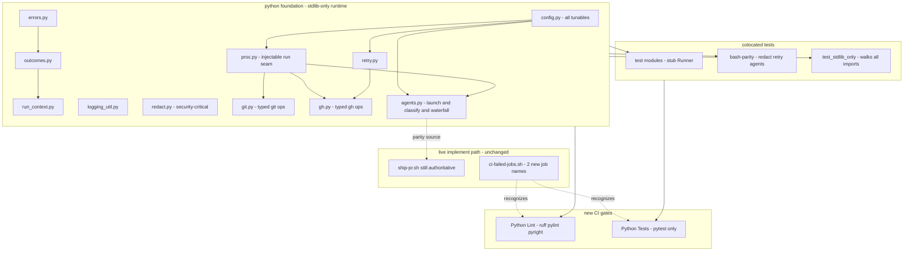

## Architecture Diagram

```mermaid
graph TD
    subgraph FND [python foundation - stdlib-only runtime]
        config[config.py - all tunables]
        proc[proc.py - injectable run seam]
        errors[errors.py]
        outcomes[outcomes.py]
        runctx[run_context.py]
        logutil[logging_util.py]
        redact[redact.py - security-critical]
        retry[retry.py]
        git[git.py - typed git ops]
        gh[gh.py - typed gh ops]
        agents[agents.py - launch and classify and waterfall]
    end

    config --> proc
    config --> retry
    config --> agents
    errors --> outcomes
    outcomes --> runctx
    proc --> git
    proc --> gh
    proc --> agents
    retry --> gh

    subgraph TST [colocated tests]
        units[test modules - stub Runner]
        parity[bash-parity - redact retry agents]
        stdlibchk[test_stdlib_only - walks all imports]
    end

    FND --> units
    FND --> parity
    FND --> stdlibchk

    subgraph CI [new CI gates]
        pylint[Python Lint - ruff pylint pyright]
        pytests[Python Tests - pytest only]
    end

    FND --> pylint
    TST --> pytests

    subgraph LIVE [live implement path - unchanged]
        shippr[ship-pr.sh still authoritative]
        cifailed[ci-failed-jobs.sh - 2 new job names]
    end

    cifailed -. recognizes .-> pylint
    cifailed -. recognizes .-> pytests
    agents -. parity source .-> shippr
```
