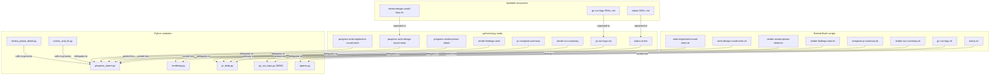

## Architecture Diagram

```mermaid
graph TD
    subgraph Retired["Retired Bash scripts"]
        RRP["render-review-phase-detail.sh"]
        RRS["render-run-summary.sh"]
        WDR["write-design-round-meta.sh"]
        WIR["write-implement-round-meta.sh"]
        RFV["render-findings-view.sh"]
        CPS["compose-pr-summary.sh"]
        GCL["gc-run-logs.sh"]
        STS["status.sh"]
    end

    subgraph CLI["python/cli.py verbs"]
        V1["progress render-phase-detail"]
        V2["progress write-design-round-meta"]
        V3["progress write-implement-round-meta"]
        V4["render findings-view"]
        V5["gc-run-logs run"]
        V6["status check"]
        VX["render run-summary"]
        VY["pr compose-summary"]
    end

    subgraph Python["Python modules"]
        PR["progress_report.py"]
        RD["rendering.py"]
        PB["pr_body.py"]
        RAF["review_and_fix.py"]
        GC["gc_run_logs.py (NEW)"]
        AG["agents.py"]
        RPD["review_phase_detail.py"]
    end

    subgraph Consumers["Updated consumers"]
        SL["review-design-step3-loop.sh"]
        GCSK["gc-run-logs SKILL.md"]
        STSK["status SKILL.md"]
    end

    RRP -->|ported into| PR
    WDR -->|ported into| PR
    WIR -->|ported into| PR
    RFV -->|ported into| RD
    GCL -->|ported into| GC
    STS -->|ported into| AG
    RRS -->|already in| PB
    CPS -->|already in| PB

    V1 -->|delegates to| PR
    V2 -->|delegates to| PR
    V3 -->|delegates to| PR
    V4 -->|delegates to| RD
    V5 -->|delegates to| GC
    V6 -->|delegates to| AG
    VX -->|delegates to| PB
    VY -->|delegates to| PB

    RAF -->|calls in-process| PR
    RPD -->|calls in-process| PR

    SL -->|repointed to| V2
    GCSK -->|repointed to| V5
    STSK -->|repointed to| V6
```
