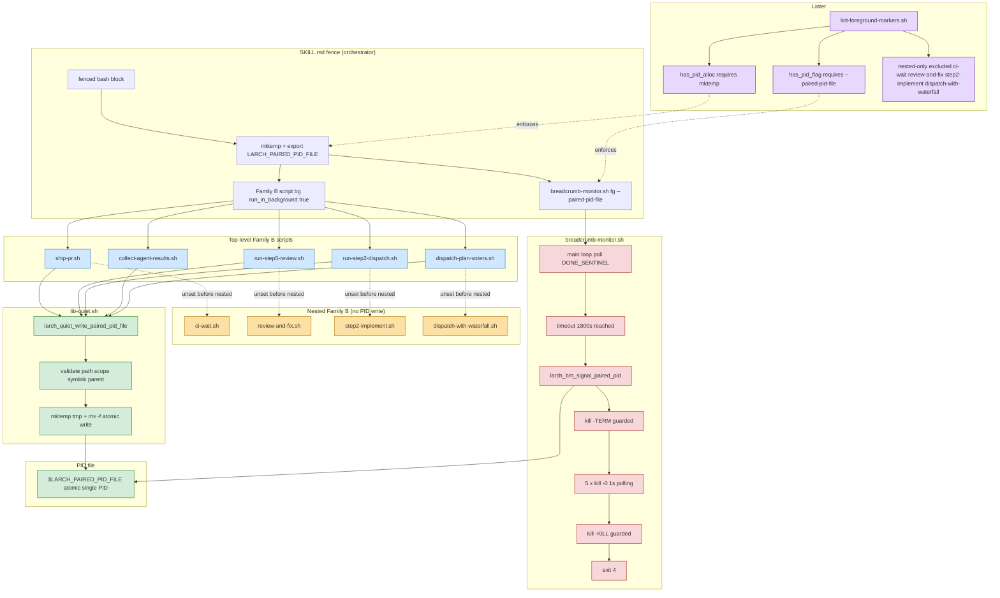

## Architecture Diagram

```mermaid
graph TD
    subgraph "SKILL.md fence (orchestrator)"
        FENCE["fenced bash block"]
        ALLOC["mktemp + export LARCH_PAIRED_PID_FILE"]
        BGLAUNCH["Family B script bg run_in_background true"]
        FGLAUNCH["breadcrumb-monitor.sh fg --paired-pid-file"]
    end

    subgraph "Top-level Family B scripts"
        SHIP["ship-pr.sh"]
        STEP5["run-step5-review.sh"]
        STEP2["run-step2-dispatch.sh"]
        COLLECT["collect-agent-results.sh"]
        VOTERS["dispatch-plan-voters.sh"]
    end

    subgraph "Nested Family B (no PID write)"
        CIWAIT["ci-wait.sh"]
        REVFIX["review-and-fix.sh"]
        IMPL["step2-implement.sh"]
        WATER["dispatch-with-waterfall.sh"]
    end

    subgraph "lib-quiet.sh"
        HELPER["larch_quiet_write_paired_pid_file"]
        VALIDATE["validate path scope symlink parent"]
        ATOMIC["mktemp tmp + mv -f atomic write"]
    end

    subgraph "breadcrumb-monitor.sh"
        MONITOR["main loop poll DONE_SENTINEL"]
        TIMEOUT["timeout 1800s reached"]
        SIGNAL["larch_bm_signal_paired_pid"]
        TERM["kill -TERM guarded"]
        WAIT["5 x kill -0 1s polling"]
        KILL["kill -KILL guarded"]
        EXIT4["exit 4"]
    end

    subgraph "PID file"
        PIDFILE["$LARCH_PAIRED_PID_FILE atomic single PID"]
    end

    subgraph "Linter"
        LINT["lint-foreground-markers.sh"]
        CHECK1["has_pid_alloc requires mktemp"]
        CHECK2["has_pid_flag requires --paired-pid-file"]
        EXCLUDE["nested-only excluded ci-wait review-and-fix step2-implement dispatch-with-waterfall"]
    end

    FENCE --> ALLOC
    ALLOC --> BGLAUNCH
    ALLOC --> FGLAUNCH
    BGLAUNCH --> SHIP
    BGLAUNCH --> STEP5
    BGLAUNCH --> STEP2
    BGLAUNCH --> COLLECT
    BGLAUNCH --> VOTERS

    SHIP --> HELPER
    STEP5 --> HELPER
    STEP2 --> HELPER
    COLLECT --> HELPER
    VOTERS --> HELPER

    HELPER --> VALIDATE
    VALIDATE --> ATOMIC
    ATOMIC --> PIDFILE

    SHIP -. unset before nested .-> CIWAIT
    STEP5 -. unset before nested .-> REVFIX
    STEP2 -. unset before nested .-> IMPL
    VOTERS -. unset before nested .-> WATER

    FGLAUNCH --> MONITOR
    MONITOR --> TIMEOUT
    TIMEOUT --> SIGNAL
    SIGNAL --> PIDFILE
    SIGNAL --> TERM
    TERM --> WAIT
    WAIT --> KILL
    KILL --> EXIT4

    LINT --> CHECK1
    LINT --> CHECK2
    LINT --> EXCLUDE
    CHECK1 -. enforces .-> ALLOC
    CHECK2 -. enforces .-> FGLAUNCH

    classDef toplvl fill:#cfe8ff,stroke:#1a5fb4
    classDef nested fill:#fde0a3,stroke:#b07000
    classDef helper fill:#d4edda,stroke:#1f7a1f
    classDef monitor fill:#f8d7da,stroke:#a82a2a
    classDef linter fill:#e9d8fd,stroke:#5500aa
    class SHIP,STEP5,STEP2,COLLECT,VOTERS toplvl
    class CIWAIT,REVFIX,IMPL,WATER nested
    class HELPER,VALIDATE,ATOMIC,PIDFILE helper
    class MONITOR,TIMEOUT,SIGNAL,TERM,WAIT,KILL,EXIT4 monitor
    class LINT,CHECK1,CHECK2,EXCLUDE linter
```
