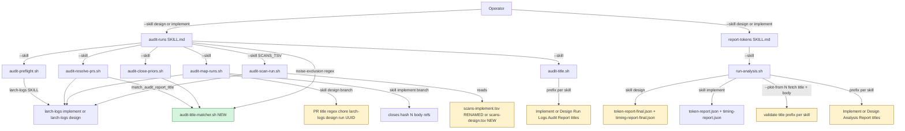

## Architecture Diagram

```mermaid
flowchart TD
    User[Operator] -->|--skill design or implement| AR[audit-runs SKILL.md]
    User -->|--skill design or implement| RT[report-tokens SKILL.md]

    AR -->|--skill| Pre[audit-preflight.sh]
    AR -->|--skill| Resolve[audit-resolve-prs.sh]
    AR -->|--skill| Map[audit-map-runs.sh]
    AR -->|--skill SCANS_TSV| Scan[audit-scan-run.sh]
    AR -->|--skill| Title[audit-title.sh]
    AR -->|--skill| Close[audit-close-priors.sh]

    Resolve -->|match_audit_report_title| Matcher[audit-title-matcher.sh NEW]
    Close --> Matcher
    AR -->|noise-exclusion regex| Matcher

    Scan -->|reads| ScansTSV[scans-implement.tsv RENAMED or scans-design.tsv NEW]
    Map -->|skill design branch| DesignPR[PR title regex chore larch-logs design run UUID]
    Map -->|skill implement branch| ImplPR[closes hash N body refs]

    Pre -->|larch-logs SKILL| Logs[larch-logs implement or larch-logs design]
    Resolve --> Logs
    Map --> Logs
    Scan --> Logs

    RT -->|--skill| Analysis[run-analysis.sh]
    Analysis -->|skill design| DesignFiles[token-report-final.json + timing-report-final.json]
    Analysis -->|skill implement| ImplFiles[token-report.json + timing-report.json]
    Analysis -->|--plot-from N fetch title + body| TitleCheck[validate title prefix per skill]

    Title -->|prefix per skill| Reports[Implement or Design Run Logs Audit Report titles]
    Analysis -->|prefix per skill| AnalysisRpt[Implement or Design Analysis Report titles]

    classDef new fill:#d4f4dd,stroke:#2e7d32
    classDef changed fill:#fff3cd,stroke:#856404
    class Matcher new
    class ScansTSV,DesignPR,DesignFiles,TitleCheck,Reports,AnalysisRpt changed
```
