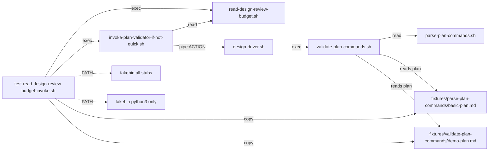

## Architecture Diagram

```mermaid
flowchart LR
  H[test-read-design-review-budget-invoke.sh]
  RB[read-design-review-budget.sh]
  INV[invoke-plan-validator-if-not-quick.sh]
  DRV[design-driver.sh]
  VPC[validate-plan-commands.sh]
  PARSE[parse-plan-commands.sh]
  FIX_OK[fixtures/parse-plan-commands/basic-plan.md]
  FIX_DEF[fixtures/validate-plan-commands/demo-plan.md]
  FBALL[fakebin all stubs]
  FBPY[fakebin python3 only]

  H -->|exec| RB
  H -->|exec| INV
  H -.->|PATH| FBALL
  H -.->|PATH| FBPY
  INV -->|read| RB
  INV -->|pipe ACTION| DRV
  DRV -->|exec| VPC
  VPC -->|read| PARSE
  H -->|copy| FIX_OK
  H -->|copy| FIX_DEF
  VPC -->|reads plan| FIX_OK
  VPC -->|reads plan| FIX_DEF
```
