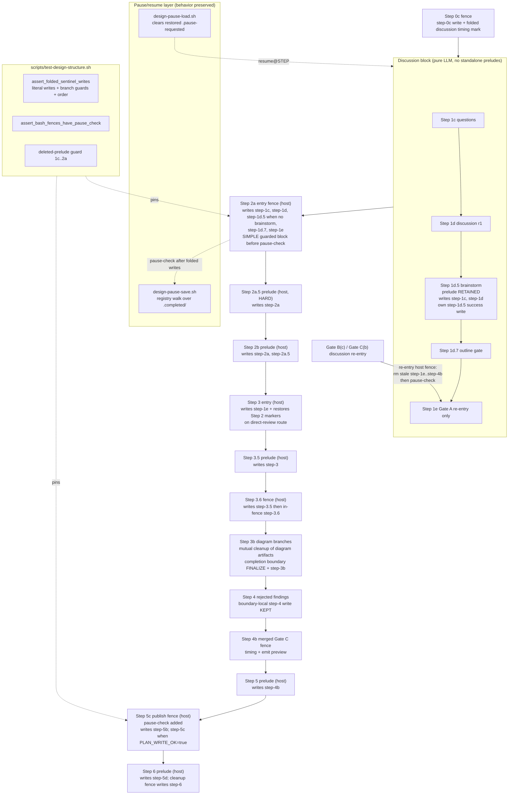

## Architecture Diagram

```mermaid
flowchart TD
    subgraph discussion["Discussion block (pure LLM, no standalone preludes)"]
        s1c["Step 1c questions"] --> s1d["Step 1d discussion r1"]
        s1d --> s1d5["Step 1d.5 brainstorm<br/>prelude RETAINED<br/>writes step-1c, step-1d<br/>own step-1d.5 success write"]
        s1d5 --> s1d7["Step 1d.7 outline gate"]
        s1d7 --> s1e["Step 1e Gate A re-entry only"]
    end

    s0c["Step 0c fence<br/>step-0c write + folded discussion timing mark"] --> discussion

    discussion --> s2a["Step 2a entry fence (host)<br/>writes step-1c, step-1d, step-1d.5 when no brainstorm,<br/>step-1d.7, step-1e<br/>SIMPLE guarded block before pause-check"]
    s2a --> s2a5["Step 2a.5 prelude (host, HARD)<br/>writes step-2a"]
    s2a5 --> s2b["Step 2b prelude (host)<br/>writes step-2a, step-2a.5"]
    s2b --> s3["Step 3 entry (host)<br/>writes step-1e + restores Step 2 markers<br/>on direct-review route"]
    s3 --> s35["Step 3.5 prelude (host)<br/>writes step-3"]
    s35 --> s36["Step 3.6 fence (host)<br/>writes step-3.5 then in-fence step-3.6"]
    s36 --> s3b["Step 3b diagram branches<br/>mutual cleanup of diagram artifacts<br/>completion boundary FINALIZE + step-3b"]
    s3b --> s4["Step 4 rejected findings<br/>boundary-local step-4 write KEPT"]
    s4 --> s4b["Step 4b merged Gate C fence<br/>timing + emit preview"]
    s4b --> s5["Step 5 prelude (host)<br/>writes step-4b"]
    s5 --> s5c["Step 5c publish fence (host)<br/>pause-check added<br/>writes step-5b; step-5c when PLAN_WRITE_OK=true"]
    s5c --> s6["Step 6 prelude (host)<br/>writes step-5d; cleanup fence writes step-6"]

    gateB["Gate B(c) / Gate C(b) discussion re-entry"] -->|"re-entry host fence:<br/>rm stale step-1e..step-4b<br/>then pause-check"| s1e

    subgraph pause["Pause/resume layer (behavior preserved)"]
        psave["design-pause-save.sh<br/>registry walk over .completed/"]
        pload["design-pause-load.sh<br/>clears restored .pause-requested"]
    end

    s2a -. "pause-check after folded writes" .-> psave
    pload -. "resume@STEP" .-> discussion

    subgraph harness["scripts/test-design-structure.sh"]
        h1["assert_folded_sentinel_writes<br/>literal writes + branch guards + order"]
        h2["assert_bash_fences_have_pause_check"]
        h3["deleted-prelude guard 1c..2a"]
    end

    harness -. "pins" .-> s2a
    harness -. "pins" .-> s5c
```
