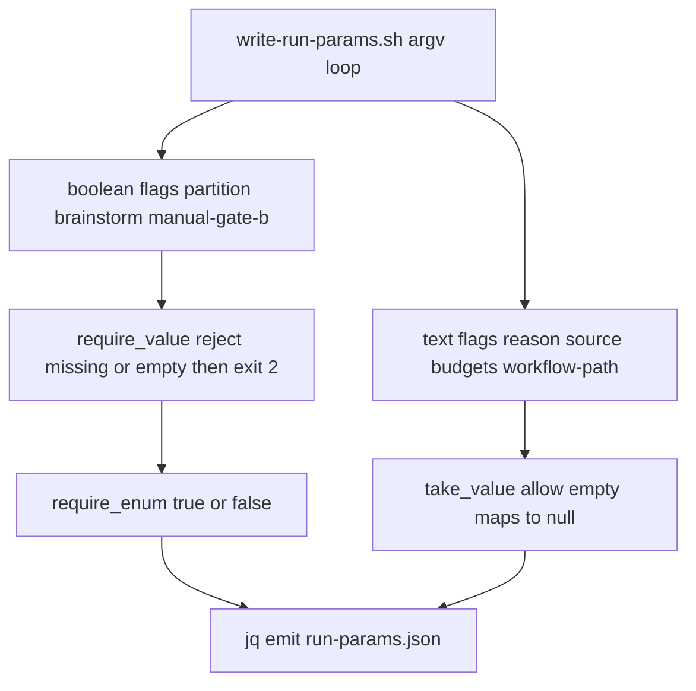

## Architecture Diagram

```mermaid
graph TD
    ARGV["write-run-params.sh argv loop"]
    BOOL["boolean flags partition brainstorm manual-gate-b"]
    TEXT["text flags reason source budgets workflow-path"]
    REQVAL["require_value reject missing or empty then exit 2"]
    TAKEVAL["take_value allow empty maps to null"]
    ENUM["require_enum true or false"]
    EMIT["jq emit run-params.json"]
    ARGV --> BOOL
    ARGV --> TEXT
    BOOL --> REQVAL
    REQVAL --> ENUM
    TEXT --> TAKEVAL
    ENUM --> EMIT
    TAKEVAL --> EMIT
```
